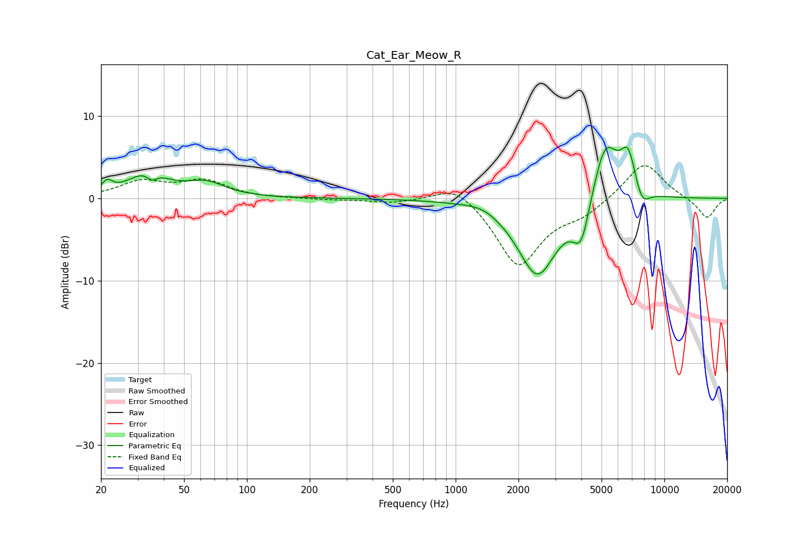

# Cat_Ear_Meow_R
See [usage instructions](https://github.com/jaakkopasanen/AutoEq#usage) for more options and info.

### Parametric EQs
Apply preamp of -6.3 dB when using parametric equalizer.

|   # | Type    |   Fc (Hz) |    Q |   Gain (dB) |
|-----|---------|-----------|------|-------------|
|   1 | Peaking |        21 | 5.62 |         1.3 |
|   2 | Peaking |        34 | 1.54 |         3   |
|   3 | Peaking |        35 | 5.52 |        -1.1 |
|   4 | Peaking |        64 | 1.55 |         1.6 |
|   5 | Peaking |      1351 | 1.71 |         0.7 |
|   6 | Peaking |      2467 | 1.45 |        -9.5 |
|   7 | Peaking |      3998 | 3.42 |        -5.2 |
|   8 | Peaking |      5208 | 2.2  |         7.7 |
|   9 | Peaking |      6714 | 3.62 |         4.9 |
|  10 | Peaking |      7798 | 3.73 |        -2.3 |

### Fixed Band EQs
When using fixed band (also called graphic) equalizer, apply preamp of **-4.1 dB** (if available) and set gains manually with these parameters.

|   # | Type    |   Fc (Hz) |    Q |   Gain (dB) |
|-----|---------|-----------|------|-------------|
|   1 | Peaking |        31 | 1.41 |         1.9 |
|   2 | Peaking |        62 | 1.41 |         2   |
|   3 | Peaking |       125 | 1.41 |        -0   |
|   4 | Peaking |       250 | 1.41 |        -0.1 |
|   5 | Peaking |       500 | 1.41 |        -0.5 |
|   6 | Peaking |      1000 | 1.41 |         2.1 |
|   7 | Peaking |      2000 | 1.41 |        -8.3 |
|   8 | Peaking |      4000 | 1.41 |        -1.6 |
|   9 | Peaking |      8000 | 1.41 |         4.6 |
|  10 | Peaking |     16000 | 1.41 |        -2.5 |

### Graphs

