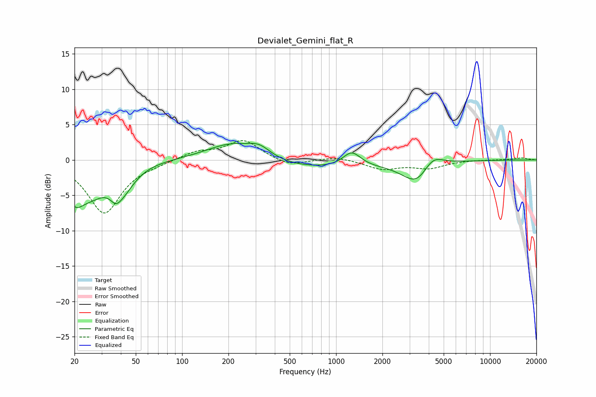

# Devialet_Gemini_flat_R
See [usage instructions](https://github.com/jaakkopasanen/AutoEq#usage) for more options and info.

### Parametric EQs
Apply preamp of -2.4 dB when using parametric equalizer.

|   # | Type    |   Fc (Hz) |    Q |   Gain (dB) |
|-----|---------|-----------|------|-------------|
|   1 | Peaking |        20 | 2.52 |        -3.8 |
|   2 | Peaking |        26 | 1.4  |        -3.6 |
|   3 | Peaking |        37 | 4    |        -1.5 |
|   4 | Peaking |        41 | 1.79 |        -3.2 |
|   5 | Peaking |       211 | 0.84 |         2.6 |
|   6 | Peaking |       318 | 1.93 |         1.4 |
|   7 | Peaking |       692 | 0.36 |        -1.3 |
|   8 | Peaking |      1264 | 2.42 |         2.1 |
|   9 | Peaking |      3391 | 1.49 |        -3.6 |
|  10 | Peaking |      4195 | 2    |         2.3 |

### Fixed Band EQs
When using fixed band (also called graphic) equalizer, apply preamp of **-2.8 dB** (if available) and set gains manually with these parameters.

|   # | Type    |   Fc (Hz) |    Q |   Gain (dB) |
|-----|---------|-----------|------|-------------|
|   1 | Peaking |        31 | 1.41 |        -7.5 |
|   2 | Peaking |        62 | 1.41 |        -0.3 |
|   3 | Peaking |       125 | 1.41 |         1.1 |
|   4 | Peaking |       250 | 1.41 |         2.8 |
|   5 | Peaking |       500 | 1.41 |        -1   |
|   6 | Peaking |      1000 | 1.41 |         0.5 |
|   7 | Peaking |      2000 | 1.41 |        -1.3 |
|   8 | Peaking |      4000 | 1.41 |        -1.1 |
|   9 | Peaking |      8000 | 1.41 |         0   |
|  10 | Peaking |     16000 | 1.41 |         0.3 |

### Graphs

