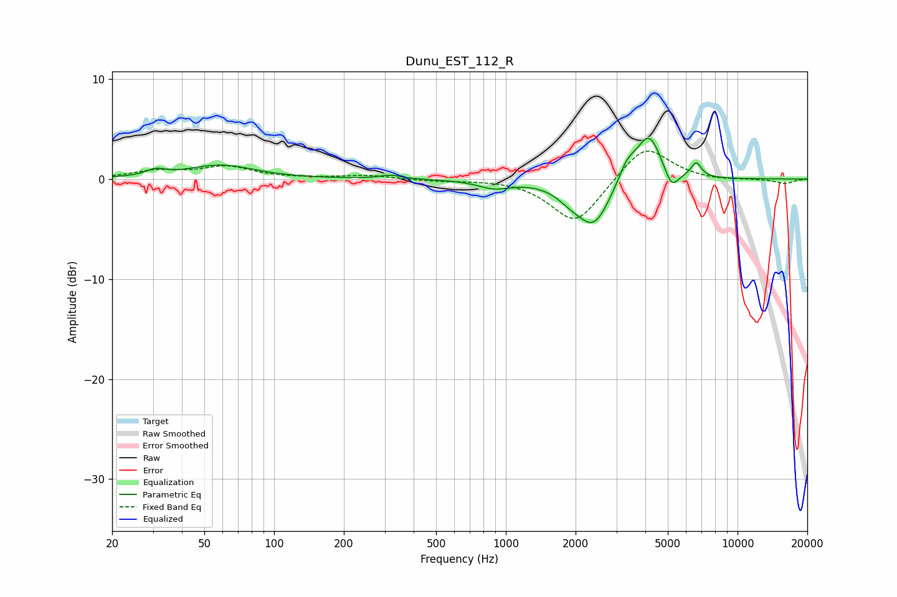

# Dunu_EST_112_R
See [usage instructions](https://github.com/jaakkopasanen/AutoEq#usage) for more options and info.

### Parametric EQs
Apply preamp of -4.2 dB when using parametric equalizer.

|   # | Type    |   Fc (Hz) |    Q |   Gain (dB) |
|-----|---------|-----------|------|-------------|
|   1 | Peaking |        31 | 3.57 |         0.6 |
|   2 | Peaking |        59 | 1    |         1.4 |
|   3 | Peaking |       317 | 3.18 |         0.4 |
|   4 | Peaking |       890 | 2.05 |        -0.8 |
|   5 | Peaking |      1905 | 2.3  |        -1.1 |
|   6 | Peaking |      2403 | 2.03 |        -4.4 |
|   7 | Peaking |      3340 | 3.73 |         1.7 |
|   8 | Peaking |      4146 | 2.58 |         4.6 |
|   9 | Peaking |      5190 | 4.58 |        -2   |
|  10 | Peaking |      6628 | 6    |         1.5 |

### Fixed Band EQs
When using fixed band (also called graphic) equalizer, apply preamp of **-2.9 dB** (if available) and set gains manually with these parameters.

|   # | Type    |   Fc (Hz) |    Q |   Gain (dB) |
|-----|---------|-----------|------|-------------|
|   1 | Peaking |        31 | 1.41 |         0.7 |
|   2 | Peaking |        62 | 1.41 |         1.2 |
|   3 | Peaking |       125 | 1.41 |         0   |
|   4 | Peaking |       250 | 1.41 |         0.4 |
|   5 | Peaking |       500 | 1.41 |        -0.2 |
|   6 | Peaking |      1000 | 1.41 |         0.1 |
|   7 | Peaking |      2000 | 1.41 |        -4.5 |
|   8 | Peaking |      4000 | 1.41 |         3.6 |
|   9 | Peaking |      8000 | 1.41 |        -0.2 |
|  10 | Peaking |     16000 | 1.41 |        -0.5 |

### Graphs

