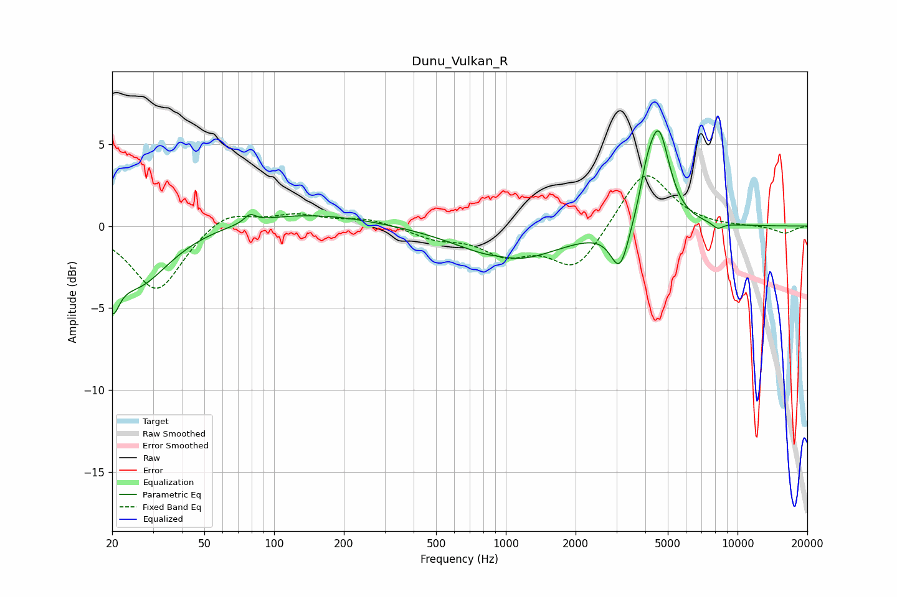

# Dunu_Vulkan_R
See [usage instructions](https://github.com/jaakkopasanen/AutoEq#usage) for more options and info.

### Parametric EQs
Apply preamp of -5.9 dB when using parametric equalizer.

|   # | Type    |   Fc (Hz) |    Q |   Gain (dB) |
|-----|---------|-----------|------|-------------|
|   1 | Peaking |        20 | 4.74 |        -2.6 |
|   2 | Peaking |        26 | 1.04 |        -3.5 |
|   3 | Peaking |        79 | 5.91 |         0.5 |
|   4 | Peaking |       134 | 0.48 |         0.8 |
|   5 | Peaking |       959 | 2.62 |         0.1 |
|   6 | Peaking |      1057 | 0.69 |        -2.1 |
|   7 | Peaking |      3111 | 3.5  |        -2.8 |
|   8 | Peaking |      4051 | 4.93 |         1.3 |
|   9 | Peaking |      4565 | 2.93 |         5.8 |
|  10 | Peaking |      8205 | 5.58 |        -0.4 |

### Fixed Band EQs
When using fixed band (also called graphic) equalizer, apply preamp of **-3.2 dB** (if available) and set gains manually with these parameters.

|   # | Type    |   Fc (Hz) |    Q |   Gain (dB) |
|-----|---------|-----------|------|-------------|
|   1 | Peaking |        31 | 1.41 |        -4   |
|   2 | Peaking |        62 | 1.41 |         1.1 |
|   3 | Peaking |       125 | 1.41 |         0.6 |
|   4 | Peaking |       250 | 1.41 |         0.5 |
|   5 | Peaking |       500 | 1.41 |        -0.7 |
|   6 | Peaking |      1000 | 1.41 |        -1.5 |
|   7 | Peaking |      2000 | 1.41 |        -2.6 |
|   8 | Peaking |      4000 | 1.41 |         3.6 |
|   9 | Peaking |      8000 | 1.41 |        -0   |
|  10 | Peaking |     16000 | 1.41 |        -0.5 |

### Graphs

