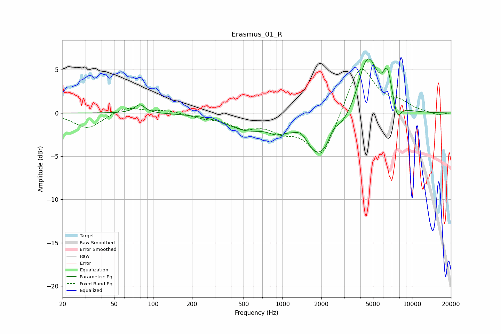

# Erasmus_01_R
See [usage instructions](https://github.com/jaakkopasanen/AutoEq#usage) for more options and info.

### Parametric EQs
Apply preamp of -6.3 dB when using parametric equalizer.

|   # | Type    |   Fc (Hz) |    Q |   Gain (dB) |
|-----|---------|-----------|------|-------------|
|   1 | Peaking |        79 | 3.61 |         1   |
|   2 | Peaking |       524 | 0.95 |        -1.6 |
|   3 | Peaking |       892 | 2.46 |        -0.7 |
|   4 | Peaking |      1412 | 2.63 |         1.3 |
|   5 | Peaking |      1910 | 1.06 |        -5.3 |
|   6 | Peaking |      2475 | 4.01 |         1.2 |
|   7 | Peaking |      4195 | 2.82 |         1.1 |
|   8 | Peaking |      4637 | 1.91 |         6   |
|   9 | Peaking |      6472 | 3.91 |         3.8 |
|  10 | Peaking |      7679 | 4.42 |        -1.9 |

### Fixed Band EQs
When using fixed band (also called graphic) equalizer, apply preamp of **-5.2 dB** (if available) and set gains manually with these parameters.

|   # | Type    |   Fc (Hz) |    Q |   Gain (dB) |
|-----|---------|-----------|------|-------------|
|   1 | Peaking |        31 | 1.41 |        -1.8 |
|   2 | Peaking |        62 | 1.41 |         0.8 |
|   3 | Peaking |       125 | 1.41 |         0.3 |
|   4 | Peaking |       250 | 1.41 |        -0.5 |
|   5 | Peaking |       500 | 1.41 |        -1.4 |
|   6 | Peaking |      1000 | 1.41 |        -1.6 |
|   7 | Peaking |      2000 | 1.41 |        -5.3 |
|   8 | Peaking |      4000 | 1.41 |         5.9 |
|   9 | Peaking |      8000 | 1.41 |         1   |
|  10 | Peaking |     16000 | 1.41 |        -0.3 |

### Graphs

