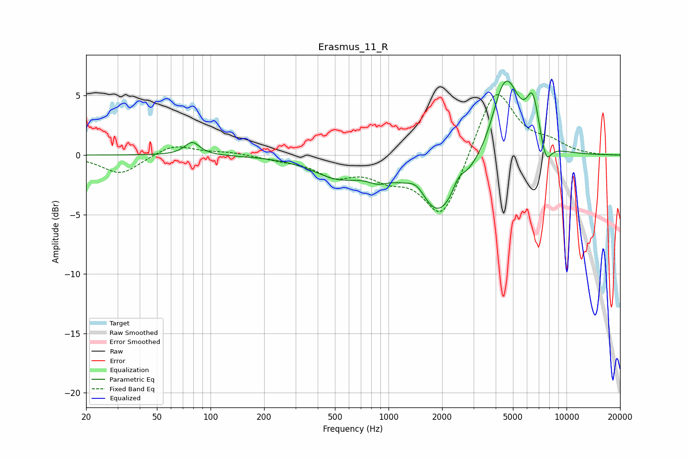

# Erasmus_11_R
See [usage instructions](https://github.com/jaakkopasanen/AutoEq#usage) for more options and info.

### Parametric EQs
Apply preamp of -6.3 dB when using parametric equalizer.

|   # | Type    |   Fc (Hz) |    Q |   Gain (dB) |
|-----|---------|-----------|------|-------------|
|   1 | Peaking |        79 | 3.37 |         1.1 |
|   2 | Peaking |       519 | 0.99 |        -1.6 |
|   3 | Peaking |       870 | 2.44 |        -0.7 |
|   4 | Peaking |      1446 | 2.61 |         1.3 |
|   5 | Peaking |      1905 | 1.05 |        -5.4 |
|   6 | Peaking |      2475 | 4.05 |         1.1 |
|   7 | Peaking |      4207 | 2.81 |         1.1 |
|   8 | Peaking |      4643 | 1.87 |         6   |
|   9 | Peaking |      6468 | 3.84 |         3.8 |
|  10 | Peaking |      7662 | 4.42 |        -1.9 |

### Fixed Band EQs
When using fixed band (also called graphic) equalizer, apply preamp of **-5.2 dB** (if available) and set gains manually with these parameters.

|   # | Type    |   Fc (Hz) |    Q |   Gain (dB) |
|-----|---------|-----------|------|-------------|
|   1 | Peaking |        31 | 1.41 |        -1.6 |
|   2 | Peaking |        62 | 1.41 |         0.9 |
|   3 | Peaking |       125 | 1.41 |         0.2 |
|   4 | Peaking |       250 | 1.41 |        -0.3 |
|   5 | Peaking |       500 | 1.41 |        -1.6 |
|   6 | Peaking |      1000 | 1.41 |        -1.5 |
|   7 | Peaking |      2000 | 1.41 |        -5.4 |
|   8 | Peaking |      4000 | 1.41 |         5.9 |
|   9 | Peaking |      8000 | 1.41 |         0.8 |
|  10 | Peaking |     16000 | 1.41 |        -0   |

### Graphs

