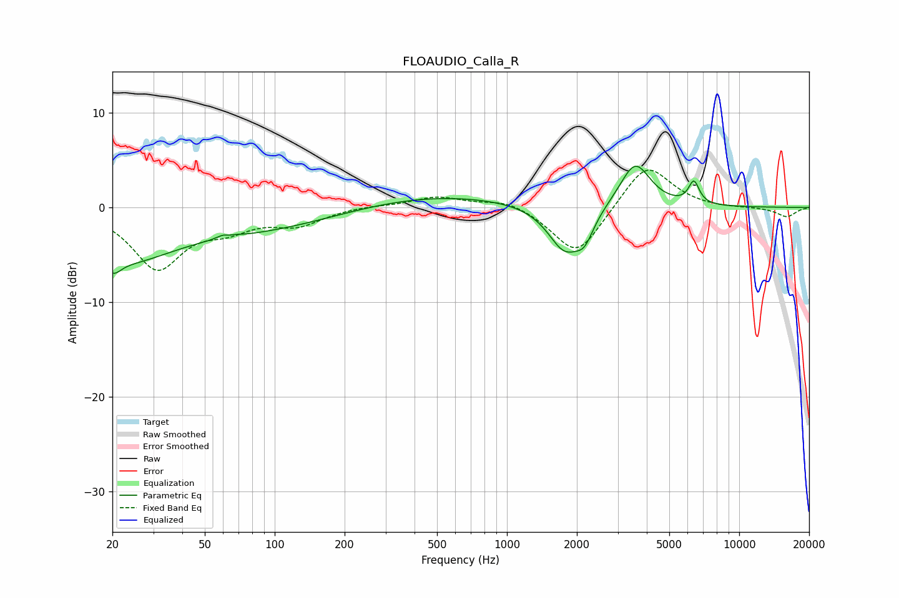

# FLOAUDIO_Calla_R
See [usage instructions](https://github.com/jaakkopasanen/AutoEq#usage) for more options and info.

### Parametric EQs
Apply preamp of -4.5 dB when using parametric equalizer.

|   # | Type    |   Fc (Hz) |    Q |   Gain (dB) |
|-----|---------|-----------|------|-------------|
|   1 | Peaking |        20 | 3.93 |        -1.9 |
|   2 | Peaking |        23 | 0.73 |        -4.6 |
|   3 | Peaking |        63 | 5.22 |         2.4 |
|   4 | Peaking |        63 | 5.86 |        -2   |
|   5 | Peaking |        89 | 0.36 |        -2.5 |
|   6 | Peaking |       410 | 0.35 |         1.6 |
|   7 | Peaking |      1774 | 1.93 |        -4.8 |
|   8 | Peaking |      2160 | 3.57 |        -2.3 |
|   9 | Peaking |      3563 | 2.15 |         4.8 |
|  10 | Peaking |      6382 | 6    |         2.4 |

### Fixed Band EQs
When using fixed band (also called graphic) equalizer, apply preamp of **-4.0 dB** (if available) and set gains manually with these parameters.

|   # | Type    |   Fc (Hz) |    Q |   Gain (dB) |
|-----|---------|-----------|------|-------------|
|   1 | Peaking |        31 | 1.41 |        -6.3 |
|   2 | Peaking |        62 | 1.41 |        -1.7 |
|   3 | Peaking |       125 | 1.41 |        -1.7 |
|   4 | Peaking |       250 | 1.41 |         0.2 |
|   5 | Peaking |       500 | 1.41 |         1.1 |
|   6 | Peaking |      1000 | 1.41 |         0.9 |
|   7 | Peaking |      2000 | 1.41 |        -5.3 |
|   8 | Peaking |      4000 | 1.41 |         4.8 |
|   9 | Peaking |      8000 | 1.41 |        -0.1 |
|  10 | Peaking |     16000 | 1.41 |        -1   |

### Graphs

