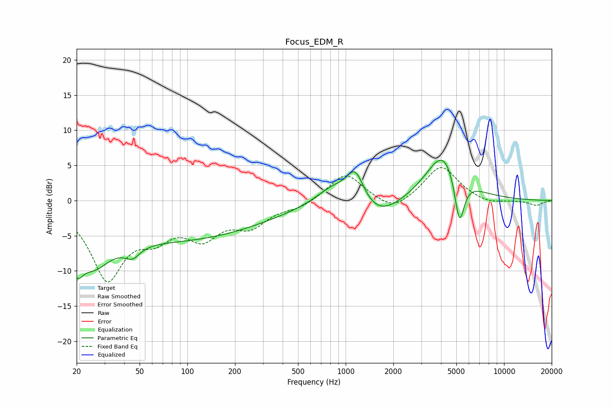

# Focus_EDM_R
See [usage instructions](https://github.com/jaakkopasanen/AutoEq#usage) for more options and info.

### Parametric EQs
Apply preamp of -5.8 dB when using parametric equalizer.

|   # | Type    |   Fc (Hz) |    Q |   Gain (dB) |
|-----|---------|-----------|------|-------------|
|   1 | Peaking |        20 | 3.88 |        -4.1 |
|   2 | Peaking |        25 | 1.24 |        -5.7 |
|   3 | Peaking |        45 | 2.94 |        -1.7 |
|   4 | Peaking |        87 | 0.25 |        -5.4 |
|   5 | Peaking |       152 | 0.23 |        -0   |
|   6 | Peaking |       837 | 1.26 |         2.6 |
|   7 | Peaking |      1151 | 2.52 |         4.7 |
|   8 | Peaking |      1576 | 0.99 |        -3   |
|   9 | Peaking |      4169 | 1.27 |         7.3 |
|  10 | Peaking |      5226 | 4.36 |        -7.4 |

### Fixed Band EQs
When using fixed band (also called graphic) equalizer, apply preamp of **-4.8 dB** (if available) and set gains manually with these parameters.

|   # | Type    |   Fc (Hz) |    Q |   Gain (dB) |
|-----|---------|-----------|------|-------------|
|   1 | Peaking |        31 | 1.41 |       -10.7 |
|   2 | Peaking |        62 | 1.41 |        -3.7 |
|   3 | Peaking |       125 | 1.41 |        -4.4 |
|   4 | Peaking |       250 | 1.41 |        -3.2 |
|   5 | Peaking |       500 | 1.41 |        -0.9 |
|   6 | Peaking |      1000 | 1.41 |         4   |
|   7 | Peaking |      2000 | 1.41 |        -1.9 |
|   8 | Peaking |      4000 | 1.41 |         5   |
|   9 | Peaking |      8000 | 1.41 |        -0.6 |
|  10 | Peaking |     16000 | 1.41 |        -0.7 |

### Graphs

