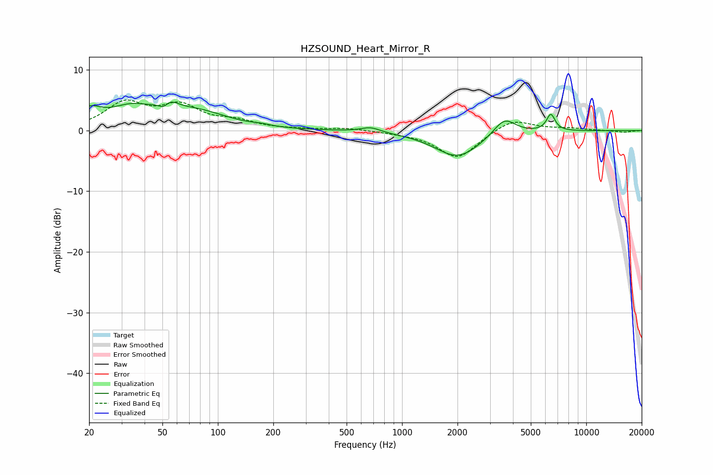

# HZSOUND_Heart_Mirror_R
See [usage instructions](https://github.com/jaakkopasanen/AutoEq#usage) for more options and info.

### Parametric EQs
Apply preamp of -4.8 dB when using parametric equalizer.

|   # | Type    |   Fc (Hz) |    Q |   Gain (dB) |
|-----|---------|-----------|------|-------------|
|   1 | Peaking |        20 | 2.16 |         2.6 |
|   2 | Peaking |        34 | 1.23 |         3   |
|   3 | Peaking |        51 | 4.31 |        -3.3 |
|   4 | Peaking |        52 | 3.2  |         4   |
|   5 | Peaking |        77 | 0.83 |         2.8 |
|   6 | Peaking |       172 | 3.08 |         0.2 |
|   7 | Peaking |       675 | 2.74 |         0.8 |
|   8 | Peaking |      2007 | 1.12 |        -4.4 |
|   9 | Peaking |      3590 | 2.32 |         2.9 |
|  10 | Peaking |      6422 | 5.91 |         2.8 |

### Fixed Band EQs
When using fixed band (also called graphic) equalizer, apply preamp of **-5.1 dB** (if available) and set gains manually with these parameters.

|   # | Type    |   Fc (Hz) |    Q |   Gain (dB) |
|-----|---------|-----------|------|-------------|
|   1 | Peaking |        31 | 1.41 |         4.3 |
|   2 | Peaking |        62 | 1.41 |         3.7 |
|   3 | Peaking |       125 | 1.41 |         1.3 |
|   4 | Peaking |       250 | 1.41 |         0.1 |
|   5 | Peaking |       500 | 1.41 |         0.4 |
|   6 | Peaking |      1000 | 1.41 |        -0.2 |
|   7 | Peaking |      2000 | 1.41 |        -4.6 |
|   8 | Peaking |      4000 | 1.41 |         2.1 |
|   9 | Peaking |      8000 | 1.41 |         0.3 |
|  10 | Peaking |     16000 | 1.41 |        -0.3 |

### Graphs

