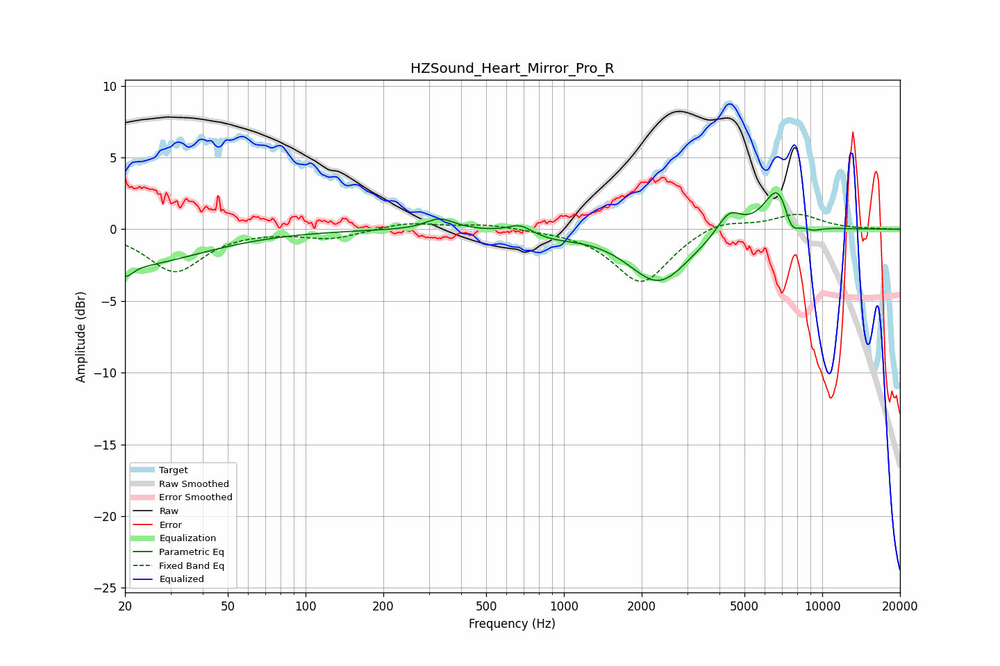

# HZSound_Heart_Mirror_Pro_R
See [usage instructions](https://github.com/jaakkopasanen/AutoEq#usage) for more options and info.

### Parametric EQs
Apply preamp of -2.6 dB when using parametric equalizer.

|   # | Type    |   Fc (Hz) |    Q |   Gain (dB) |
|-----|---------|-----------|------|-------------|
|   1 | Peaking |        20 | 0.5  |        -2.5 |
|   2 | Peaking |        20 | 5.5  |        -0.8 |
|   3 | Peaking |       331 | 2.54 |         0.8 |
|   4 | Peaking |       677 | 3.1  |         0.6 |
|   5 | Peaking |       903 | 1.48 |        -0.4 |
|   6 | Peaking |      2329 | 1.22 |        -3.7 |
|   7 | Peaking |      4361 | 2.89 |         1.6 |
|   8 | Peaking |      6819 | 2.43 |         3.6 |
|   9 | Peaking |      7562 | 4.01 |        -2   |
|  10 | Peaking |      9103 | 3.07 |        -0.4 |

### Fixed Band EQs
When using fixed band (also called graphic) equalizer, apply preamp of **-1.1 dB** (if available) and set gains manually with these parameters.

|   # | Type    |   Fc (Hz) |    Q |   Gain (dB) |
|-----|---------|-----------|------|-------------|
|   1 | Peaking |        31 | 1.41 |        -2.9 |
|   2 | Peaking |        62 | 1.41 |        -0   |
|   3 | Peaking |       125 | 1.41 |        -0.6 |
|   4 | Peaking |       250 | 1.41 |         0.5 |
|   5 | Peaking |       500 | 1.41 |         0.3 |
|   6 | Peaking |      1000 | 1.41 |        -0   |
|   7 | Peaking |      2000 | 1.41 |        -3.8 |
|   8 | Peaking |      4000 | 1.41 |         0.7 |
|   9 | Peaking |      8000 | 1.41 |         1   |
|  10 | Peaking |     16000 | 1.41 |         0   |

### Graphs

