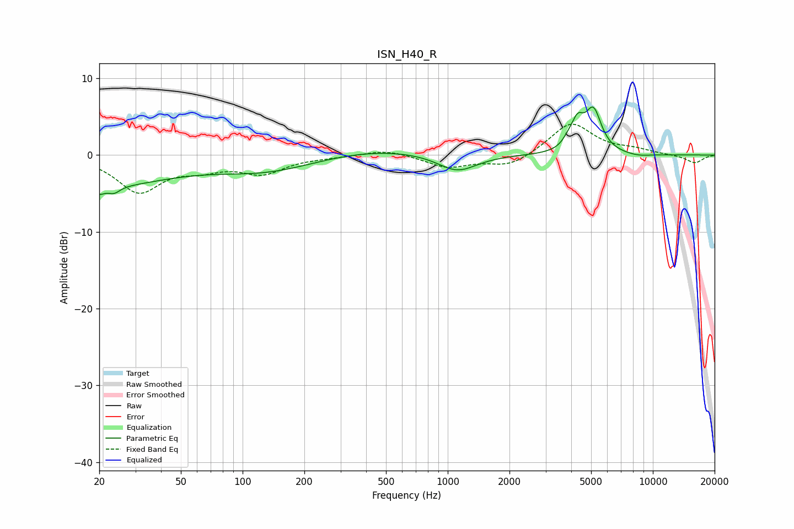

# ISN_H40_R
See [usage instructions](https://github.com/jaakkopasanen/AutoEq#usage) for more options and info.

### Parametric EQs
Apply preamp of -6.3 dB when using parametric equalizer.

|   # | Type    |   Fc (Hz) |    Q |   Gain (dB) |
|-----|---------|-----------|------|-------------|
|   1 | Peaking |        20 | 5.41 |        -0.9 |
|   2 | Peaking |        21 | 0.44 |        -3.8 |
|   3 | Peaking |        24 | 4.88 |        -0.8 |
|   4 | Peaking |       133 | 0.57 |        -2.1 |
|   5 | Peaking |       424 | 0.49 |         1   |
|   6 | Peaking |      1114 | 1.48 |        -2.3 |
|   7 | Peaking |      3856 | 5.23 |         0.7 |
|   8 | Peaking |      4292 | 4.47 |         3.3 |
|   9 | Peaking |      5132 | 3.54 |         5.4 |
|  10 | Peaking |      8483 | 2.13 |        -0.3 |

### Fixed Band EQs
When using fixed band (also called graphic) equalizer, apply preamp of **-4.1 dB** (if available) and set gains manually with these parameters.

|   # | Type    |   Fc (Hz) |    Q |   Gain (dB) |
|-----|---------|-----------|------|-------------|
|   1 | Peaking |        31 | 1.41 |        -4.6 |
|   2 | Peaking |        62 | 1.41 |        -1.4 |
|   3 | Peaking |       125 | 1.41 |        -2.2 |
|   4 | Peaking |       250 | 1.41 |        -0.2 |
|   5 | Peaking |       500 | 1.41 |         0.8 |
|   6 | Peaking |      1000 | 1.41 |        -1.6 |
|   7 | Peaking |      2000 | 1.41 |        -1.5 |
|   8 | Peaking |      4000 | 1.41 |         4.2 |
|   9 | Peaking |      8000 | 1.41 |         0.6 |
|  10 | Peaking |     16000 | 1.41 |        -1.1 |

### Graphs

