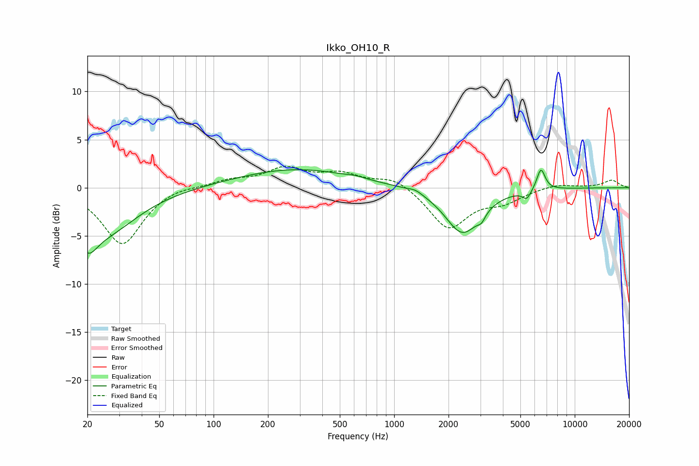

# Ikko_OH10_R
See [usage instructions](https://github.com/jaakkopasanen/AutoEq#usage) for more options and info.

### Parametric EQs
Apply preamp of -2.0 dB when using parametric equalizer.

|   # | Type    |   Fc (Hz) |    Q |   Gain (dB) |
|-----|---------|-----------|------|-------------|
|   1 | Peaking |        20 | 2.66 |        -3   |
|   2 | Peaking |        25 | 0.78 |        -4.3 |
|   3 | Peaking |       286 | 0.44 |         2   |
|   4 | Peaking |       613 | 3.37 |         0.2 |
|   5 | Peaking |      1309 | 3.77 |         0.3 |
|   6 | Peaking |      2386 | 1.48 |        -4.7 |
|   7 | Peaking |      3076 | 5.92 |        -1.5 |
|   8 | Peaking |      3118 | 5.99 |         0.7 |
|   9 | Peaking |      5425 | 6    |        -0.9 |
|  10 | Peaking |      6499 | 5.89 |         2.3 |

### Fixed Band EQs
When using fixed band (also called graphic) equalizer, apply preamp of **-2.3 dB** (if available) and set gains manually with these parameters.

|   # | Type    |   Fc (Hz) |    Q |   Gain (dB) |
|-----|---------|-----------|------|-------------|
|   1 | Peaking |        31 | 1.41 |        -5.9 |
|   2 | Peaking |        62 | 1.41 |         0.3 |
|   3 | Peaking |       125 | 1.41 |         0.7 |
|   4 | Peaking |       250 | 1.41 |         1.9 |
|   5 | Peaking |       500 | 1.41 |         1.3 |
|   6 | Peaking |      1000 | 1.41 |         1.1 |
|   7 | Peaking |      2000 | 1.41 |        -4.2 |
|   8 | Peaking |      4000 | 1.41 |        -1.3 |
|   9 | Peaking |      8000 | 1.41 |         0.4 |
|  10 | Peaking |     16000 | 1.41 |         0.8 |

### Graphs

