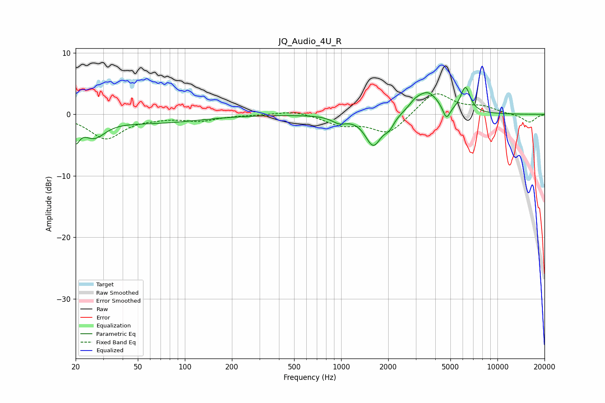

# JQ_Audio_4U_R
See [usage instructions](https://github.com/jaakkopasanen/AutoEq#usage) for more options and info.

### Parametric EQs
Apply preamp of -4.5 dB when using parametric equalizer.

|   # | Type    |   Fc (Hz) |    Q |   Gain (dB) |
|-----|---------|-----------|------|-------------|
|   1 | Peaking |        20 | 5.77 |        -3   |
|   2 | Peaking |        26 | 1.96 |        -3   |
|   3 | Peaking |        64 | 0.49 |        -1.3 |
|   4 | Peaking |       974 | 3.04 |        -1   |
|   5 | Peaking |      1607 | 2.72 |        -5   |
|   6 | Peaking |      2029 | 4.67 |        -1.4 |
|   7 | Peaking |      2966 | 3.6  |         0.8 |
|   8 | Peaking |      3575 | 1.94 |         3.5 |
|   9 | Peaking |      4716 | 6    |        -2.3 |
|  10 | Peaking |      6240 | 4.58 |         4.1 |

### Fixed Band EQs
When using fixed band (also called graphic) equalizer, apply preamp of **-3.4 dB** (if available) and set gains manually with these parameters.

|   # | Type    |   Fc (Hz) |    Q |   Gain (dB) |
|-----|---------|-----------|------|-------------|
|   1 | Peaking |        31 | 1.41 |        -3.9 |
|   2 | Peaking |        62 | 1.41 |        -0.3 |
|   3 | Peaking |       125 | 1.41 |        -0.9 |
|   4 | Peaking |       250 | 1.41 |        -0.1 |
|   5 | Peaking |       500 | 1.41 |         0.7 |
|   6 | Peaking |      1000 | 1.41 |        -1.6 |
|   7 | Peaking |      2000 | 1.41 |        -3.2 |
|   8 | Peaking |      4000 | 1.41 |         3.8 |
|   9 | Peaking |      8000 | 1.41 |         1.1 |
|  10 | Peaking |     16000 | 1.41 |        -1.3 |

### Graphs

