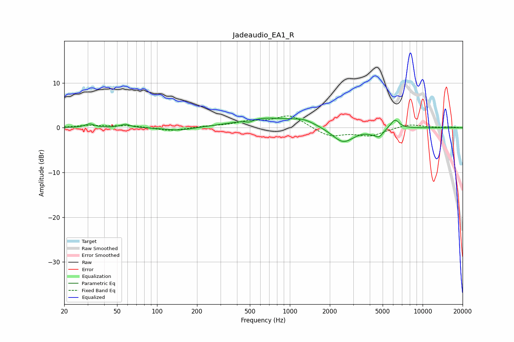

# Jadeaudio_EA1_R
See [usage instructions](https://github.com/jaakkopasanen/AutoEq#usage) for more options and info.

### Parametric EQs
Apply preamp of -2.2 dB when using parametric equalizer.

|   # | Type    |   Fc (Hz) |    Q |   Gain (dB) |
|-----|---------|-----------|------|-------------|
|   1 | Peaking |        31 | 4.23 |         0.8 |
|   2 | Peaking |        58 | 3.8  |         0.7 |
|   3 | Peaking |       148 | 1.39 |        -0.7 |
|   4 | Peaking |       494 | 5.23 |        -0.5 |
|   5 | Peaking |       656 | 0.68 |         2.1 |
|   6 | Peaking |      1276 | 1.66 |         1.2 |
|   7 | Peaking |      2520 | 1.72 |        -3.5 |
|   8 | Peaking |      4032 | 4.11 |        -0.4 |
|   9 | Peaking |      4689 | 4.2  |        -1.7 |
|  10 | Peaking |      6181 | 4.15 |         2.1 |

### Fixed Band EQs
When using fixed band (also called graphic) equalizer, apply preamp of **-2.7 dB** (if available) and set gains manually with these parameters.

|   # | Type    |   Fc (Hz) |    Q |   Gain (dB) |
|-----|---------|-----------|------|-------------|
|   1 | Peaking |        31 | 1.41 |         0.5 |
|   2 | Peaking |        62 | 1.41 |         0.5 |
|   3 | Peaking |       125 | 1.41 |        -0.8 |
|   4 | Peaking |       250 | 1.41 |         0.3 |
|   5 | Peaking |       500 | 1.41 |         1.2 |
|   6 | Peaking |      1000 | 1.41 |         2.8 |
|   7 | Peaking |      2000 | 1.41 |        -2   |
|   8 | Peaking |      4000 | 1.41 |        -1.7 |
|   9 | Peaking |      8000 | 1.41 |         0.8 |
|  10 | Peaking |     16000 | 1.41 |         0.2 |

### Graphs

