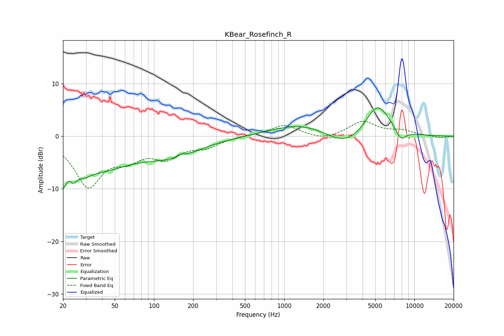

# KBear_Rosefinch_R
See [usage instructions](https://github.com/jaakkopasanen/AutoEq#usage) for more options and info.

### Parametric EQs
Apply preamp of -5.5 dB when using parametric equalizer.

|   # | Type    |   Fc (Hz) |    Q |   Gain (dB) |
|-----|---------|-----------|------|-------------|
|   1 | Peaking |        20 | 5.1  |        -5.5 |
|   2 | Peaking |        24 | 5.52 |        -2.1 |
|   3 | Peaking |        28 | 1.95 |        -2.6 |
|   4 | Peaking |        40 | 0.62 |        -5.2 |
|   5 | Peaking |       138 | 0.64 |        -3.2 |
|   6 | Peaking |       159 | 5.18 |         0.5 |
|   7 | Peaking |      1363 | 0.64 |         2.4 |
|   8 | Peaking |      3018 | 0.92 |        -3   |
|   9 | Peaking |      5205 | 1.43 |         6.5 |
|  10 | Peaking |      7878 | 3.24 |        -2.1 |

### Fixed Band EQs
When using fixed band (also called graphic) equalizer, apply preamp of **-2.9 dB** (if available) and set gains manually with these parameters.

|   # | Type    |   Fc (Hz) |    Q |   Gain (dB) |
|-----|---------|-----------|------|-------------|
|   1 | Peaking |        31 | 1.41 |        -9.1 |
|   2 | Peaking |        62 | 1.41 |        -3.2 |
|   3 | Peaking |       125 | 1.41 |        -3.5 |
|   4 | Peaking |       250 | 1.41 |        -1.8 |
|   5 | Peaking |       500 | 1.41 |         0.2 |
|   6 | Peaking |      1000 | 1.41 |         2.1 |
|   7 | Peaking |      2000 | 1.41 |        -0.8 |
|   8 | Peaking |      4000 | 1.41 |         2.8 |
|   9 | Peaking |      8000 | 1.41 |         0.9 |
|  10 | Peaking |     16000 | 1.41 |        -0.3 |

### Graphs

