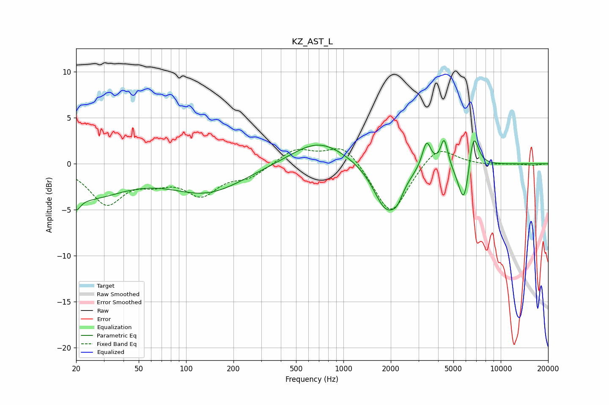

# KZ_AST_L
See [usage instructions](https://github.com/jaakkopasanen/AutoEq#usage) for more options and info.

### Parametric EQs
Apply preamp of -2.6 dB when using parametric equalizer.

|   # | Type    |   Fc (Hz) |    Q |   Gain (dB) |
|-----|---------|-----------|------|-------------|
|   1 | Peaking |        20 | 5.37 |        -1.4 |
|   2 | Peaking |        22 | 0.56 |        -3.5 |
|   3 | Peaking |       136 | 0.6  |        -3   |
|   4 | Peaking |       698 | 0.81 |         2.7 |
|   5 | Peaking |      1868 | 1.72 |        -5   |
|   6 | Peaking |      2198 | 3.8  |        -1.3 |
|   7 | Peaking |      3379 | 5.08 |         2.9 |
|   8 | Peaking |      4371 | 6    |         3.1 |
|   9 | Peaking |      5864 | 3.69 |        -5.2 |
|  10 | Peaking |      6681 | 4.16 |         4.7 |

### Fixed Band EQs
When using fixed band (also called graphic) equalizer, apply preamp of **-1.7 dB** (if available) and set gains manually with these parameters.

|   # | Type    |   Fc (Hz) |    Q |   Gain (dB) |
|-----|---------|-----------|------|-------------|
|   1 | Peaking |        31 | 1.41 |        -4.2 |
|   2 | Peaking |        62 | 1.41 |        -1.4 |
|   3 | Peaking |       125 | 1.41 |        -3.1 |
|   4 | Peaking |       250 | 1.41 |        -1.3 |
|   5 | Peaking |       500 | 1.41 |         1.7 |
|   6 | Peaking |      1000 | 1.41 |         2.3 |
|   7 | Peaking |      2000 | 1.41 |        -5.8 |
|   8 | Peaking |      4000 | 1.41 |         2.2 |
|   9 | Peaking |      8000 | 1.41 |        -0.1 |
|  10 | Peaking |     16000 | 1.41 |        -0.2 |

### Graphs

