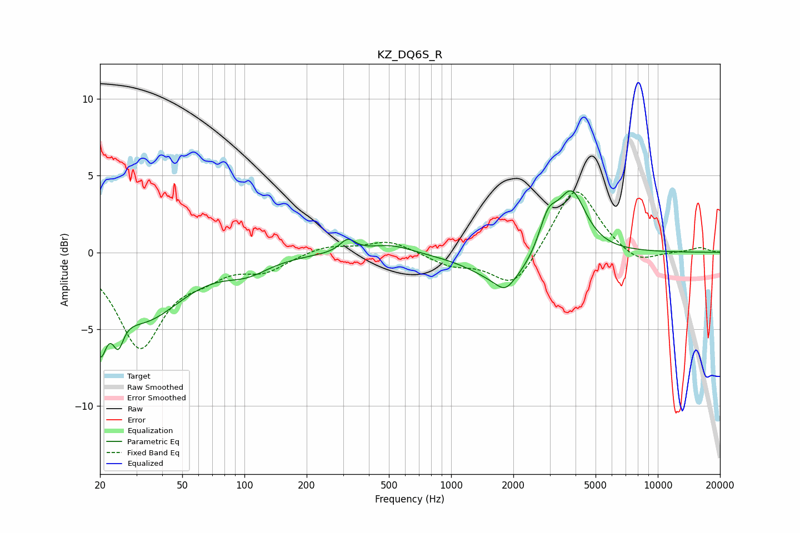

# KZ_DQ6S_R
See [usage instructions](https://github.com/jaakkopasanen/AutoEq#usage) for more options and info.

### Parametric EQs
Apply preamp of -4.1 dB when using parametric equalizer.

|   # | Type    |   Fc (Hz) |    Q |   Gain (dB) |
|-----|---------|-----------|------|-------------|
|   1 | Peaking |        20 | 4.78 |        -3.7 |
|   2 | Peaking |        24 | 5.5  |        -1.9 |
|   3 | Peaking |        32 | 0.74 |        -4.2 |
|   4 | Peaking |       103 | 1.33 |        -0.9 |
|   5 | Peaking |       316 | 3.77 |         0.8 |
|   6 | Peaking |       511 | 1.32 |         0.6 |
|   7 | Peaking |      1827 | 3.35 |        -0.7 |
|   8 | Peaking |      1847 | 0.97 |        -2.1 |
|   9 | Peaking |      2939 | 3.16 |         2.1 |
|  10 | Peaking |      3824 | 2    |         4.1 |

### Fixed Band EQs
When using fixed band (also called graphic) equalizer, apply preamp of **-4.0 dB** (if available) and set gains manually with these parameters.

|   # | Type    |   Fc (Hz) |    Q |   Gain (dB) |
|-----|---------|-----------|------|-------------|
|   1 | Peaking |        31 | 1.41 |        -6   |
|   2 | Peaking |        62 | 1.41 |        -1.1 |
|   3 | Peaking |       125 | 1.41 |        -1.1 |
|   4 | Peaking |       250 | 1.41 |         0.5 |
|   5 | Peaking |       500 | 1.41 |         0.8 |
|   6 | Peaking |      1000 | 1.41 |        -0.8 |
|   7 | Peaking |      2000 | 1.41 |        -2.4 |
|   8 | Peaking |      4000 | 1.41 |         4.5 |
|   9 | Peaking |      8000 | 1.41 |        -0.9 |
|  10 | Peaking |     16000 | 1.41 |         0.3 |

### Graphs

