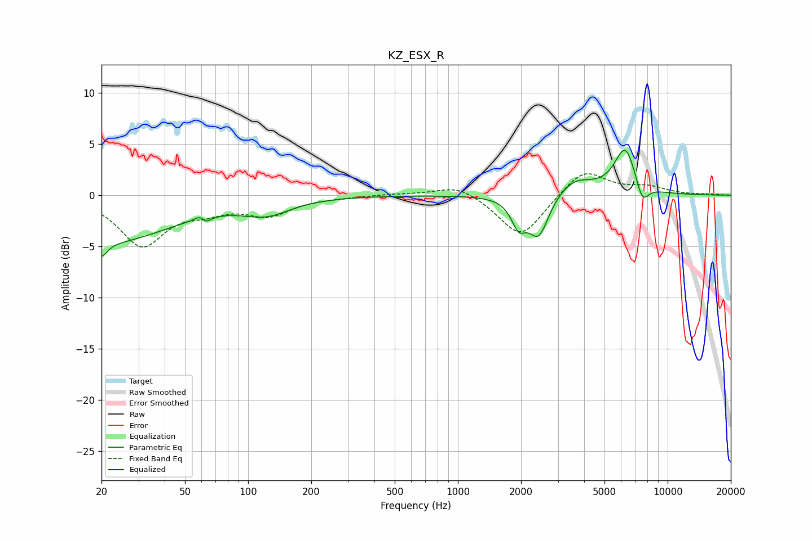

# KZ_ESX_R
See [usage instructions](https://github.com/jaakkopasanen/AutoEq#usage) for more options and info.

### Parametric EQs
Apply preamp of -4.5 dB when using parametric equalizer.

|   # | Type    |   Fc (Hz) |    Q |   Gain (dB) |
|-----|---------|-----------|------|-------------|
|   1 | Peaking |        20 | 5.17 |        -1.4 |
|   2 | Peaking |        21 | 0.45 |        -4.5 |
|   3 | Peaking |        61 | 5.52 |         1.6 |
|   4 | Peaking |        62 | 5.77 |        -1.7 |
|   5 | Peaking |       122 | 1.22 |        -1.5 |
|   6 | Peaking |      1948 | 4.1  |        -2.4 |
|   7 | Peaking |      2425 | 2.9  |        -4.1 |
|   8 | Peaking |      3589 | 1.58 |         1.6 |
|   9 | Peaking |      6282 | 2.66 |         4.6 |
|  10 | Peaking |      7565 | 4.38 |        -2.1 |

### Fixed Band EQs
When using fixed band (also called graphic) equalizer, apply preamp of **-2.2 dB** (if available) and set gains manually with these parameters.

|   # | Type    |   Fc (Hz) |    Q |   Gain (dB) |
|-----|---------|-----------|------|-------------|
|   1 | Peaking |        31 | 1.41 |        -4.8 |
|   2 | Peaking |        62 | 1.41 |        -1.1 |
|   3 | Peaking |       125 | 1.41 |        -1.8 |
|   4 | Peaking |       250 | 1.41 |        -0.1 |
|   5 | Peaking |       500 | 1.41 |         0.1 |
|   6 | Peaking |      1000 | 1.41 |         1.1 |
|   7 | Peaking |      2000 | 1.41 |        -4.2 |
|   8 | Peaking |      4000 | 1.41 |         2.7 |
|   9 | Peaking |      8000 | 1.41 |         0.7 |
|  10 | Peaking |     16000 | 1.41 |         0.1 |

### Graphs

