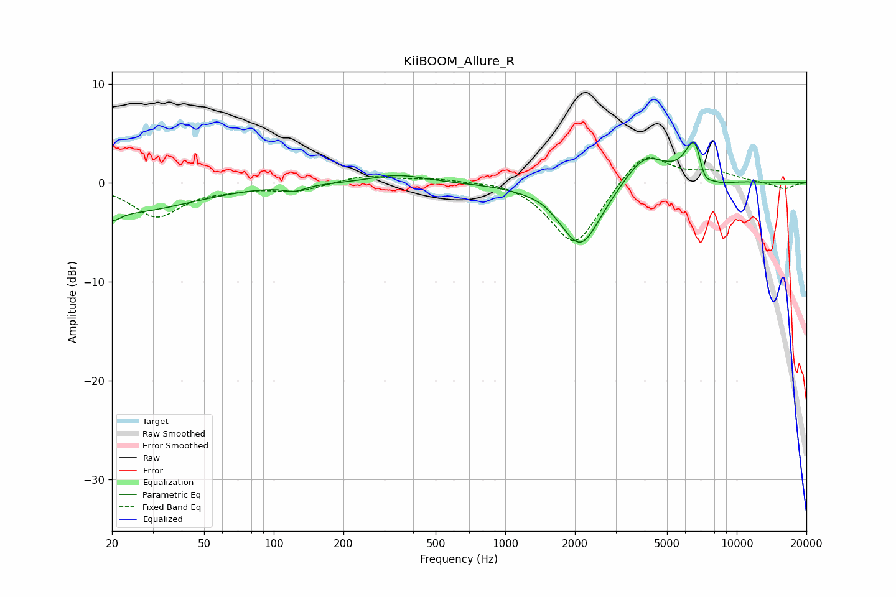

# KiiBOOM_Allure_R
See [usage instructions](https://github.com/jaakkopasanen/AutoEq#usage) for more options and info.

### Parametric EQs
Apply preamp of -4.2 dB when using parametric equalizer.

|   # | Type    |   Fc (Hz) |    Q |   Gain (dB) |
|-----|---------|-----------|------|-------------|
|   1 | Peaking |        20 | 4.11 |        -1   |
|   2 | Peaking |        23 | 0.51 |        -2.9 |
|   3 | Peaking |       123 | 3.26 |        -0.6 |
|   4 | Peaking |       344 | 1.23 |         0.8 |
|   5 | Peaking |      1446 | 4.4  |         0.1 |
|   6 | Peaking |      2116 | 1.57 |        -6.6 |
|   7 | Peaking |      4007 | 1.55 |         3.2 |
|   8 | Peaking |      6651 | 3.32 |         5.5 |
|   9 | Peaking |      7159 | 4    |        -3   |
|  10 | Peaking |      8560 | 2.52 |        -0.5 |

### Fixed Band EQs
When using fixed band (also called graphic) equalizer, apply preamp of **-2.6 dB** (if available) and set gains manually with these parameters.

|   # | Type    |   Fc (Hz) |    Q |   Gain (dB) |
|-----|---------|-----------|------|-------------|
|   1 | Peaking |        31 | 1.41 |        -3.4 |
|   2 | Peaking |        62 | 1.41 |        -0.4 |
|   3 | Peaking |       125 | 1.41 |        -0.8 |
|   4 | Peaking |       250 | 1.41 |         0.8 |
|   5 | Peaking |       500 | 1.41 |         0.4 |
|   6 | Peaking |      1000 | 1.41 |         0.4 |
|   7 | Peaking |      2000 | 1.41 |        -6.6 |
|   8 | Peaking |      4000 | 1.41 |         3.4 |
|   9 | Peaking |      8000 | 1.41 |         1   |
|  10 | Peaking |     16000 | 1.41 |        -0.7 |

### Graphs

