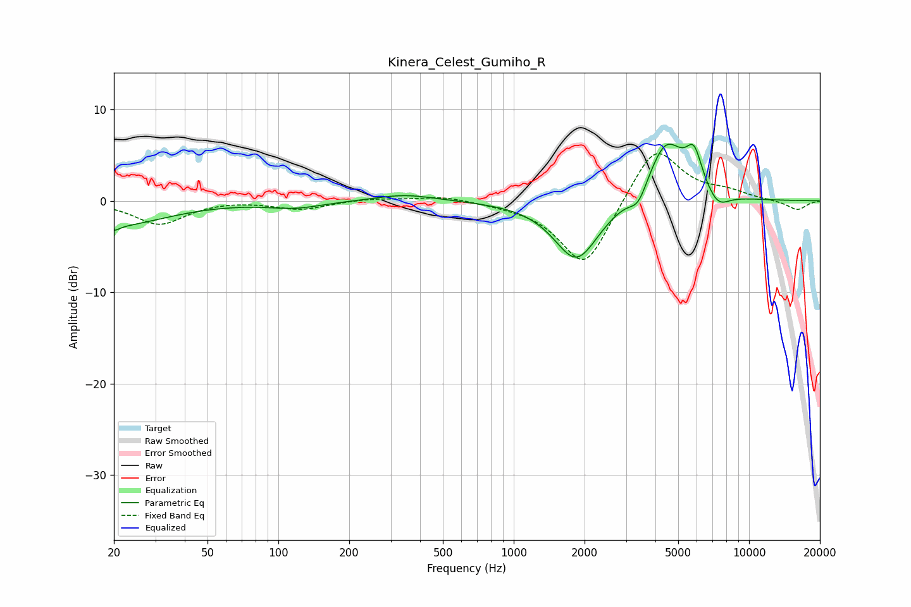

# Kinera_Celest_Gumiho_R
See [usage instructions](https://github.com/jaakkopasanen/AutoEq#usage) for more options and info.

### Parametric EQs
Apply preamp of -6.3 dB when using parametric equalizer.

|   # | Type    |   Fc (Hz) |    Q |   Gain (dB) |
|-----|---------|-----------|------|-------------|
|   1 | Peaking |        20 | 5.97 |        -0.6 |
|   2 | Peaking |        20 | 0.65 |        -2.7 |
|   3 | Peaking |       118 | 1.23 |        -0.7 |
|   4 | Peaking |       345 | 1.11 |         0.7 |
|   5 | Peaking |      1840 | 1.49 |        -6.3 |
|   6 | Peaking |      2038 | 1.72 |        -0.3 |
|   7 | Peaking |      3387 | 3.79 |        -2   |
|   8 | Peaking |      4441 | 1.76 |         6.7 |
|   9 | Peaking |      5839 | 4.01 |         3.8 |
|  10 | Peaking |      7368 | 2.86 |        -1.7 |

### Fixed Band EQs
When using fixed band (also called graphic) equalizer, apply preamp of **-5.3 dB** (if available) and set gains manually with these parameters.

|   # | Type    |   Fc (Hz) |    Q |   Gain (dB) |
|-----|---------|-----------|------|-------------|
|   1 | Peaking |        31 | 1.41 |        -2.6 |
|   2 | Peaking |        62 | 1.41 |         0.1 |
|   3 | Peaking |       125 | 1.41 |        -0.9 |
|   4 | Peaking |       250 | 1.41 |         0.3 |
|   5 | Peaking |       500 | 1.41 |         0.6 |
|   6 | Peaking |      1000 | 1.41 |        -0.2 |
|   7 | Peaking |      2000 | 1.41 |        -7.5 |
|   8 | Peaking |      4000 | 1.41 |         6.4 |
|   9 | Peaking |      8000 | 1.41 |         0.8 |
|  10 | Peaking |     16000 | 1.41 |        -1   |

### Graphs

