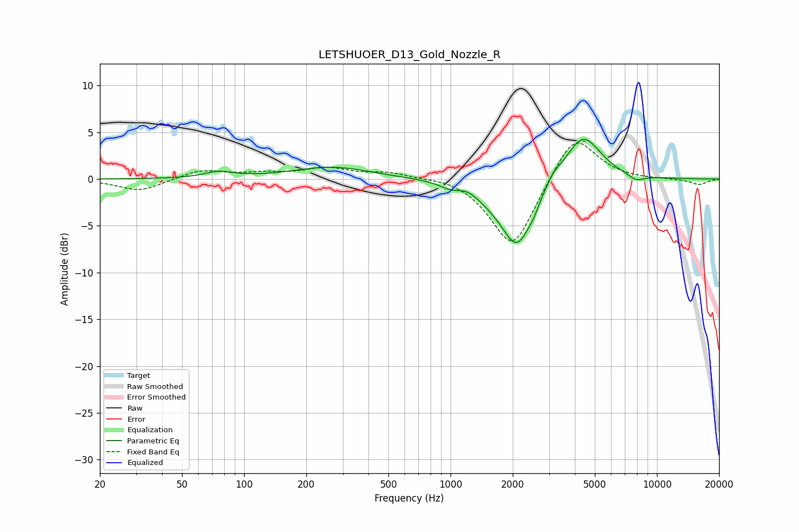

# LETSHUOER_D13_Gold_Nozzle_R
See [usage instructions](https://github.com/jaakkopasanen/AutoEq#usage) for more options and info.

### Parametric EQs
Apply preamp of -4.3 dB when using parametric equalizer.

|   # | Type    |   Fc (Hz) |    Q |   Gain (dB) |
|-----|---------|-----------|------|-------------|
|   1 | Peaking |        75 | 2.09 |         0.7 |
|   2 | Peaking |       267 | 0.74 |         1.3 |
|   3 | Peaking |       994 | 3.03 |        -0.5 |
|   4 | Peaking |      1228 | 2.87 |         0.4 |
|   5 | Peaking |      1568 | 1.42 |        -1.1 |
|   6 | Peaking |      2104 | 1.87 |        -6.7 |
|   7 | Peaking |      2530 | 5.64 |        -0.6 |
|   8 | Peaking |      3164 | 4.2  |         0.7 |
|   9 | Peaking |      4378 | 1.62 |         4.9 |
|  10 | Peaking |      7929 | 3.34 |        -0.7 |

### Fixed Band EQs
When using fixed band (also called graphic) equalizer, apply preamp of **-3.9 dB** (if available) and set gains manually with these parameters.

|   # | Type    |   Fc (Hz) |    Q |   Gain (dB) |
|-----|---------|-----------|------|-------------|
|   1 | Peaking |        31 | 1.41 |        -1.3 |
|   2 | Peaking |        62 | 1.41 |         1   |
|   3 | Peaking |       125 | 1.41 |         0.5 |
|   4 | Peaking |       250 | 1.41 |         1.1 |
|   5 | Peaking |       500 | 1.41 |         0.7 |
|   6 | Peaking |      1000 | 1.41 |         0.4 |
|   7 | Peaking |      2000 | 1.41 |        -7.6 |
|   8 | Peaking |      4000 | 1.41 |         5.2 |
|   9 | Peaking |      8000 | 1.41 |        -0   |
|  10 | Peaking |     16000 | 1.41 |        -0.6 |

### Graphs

