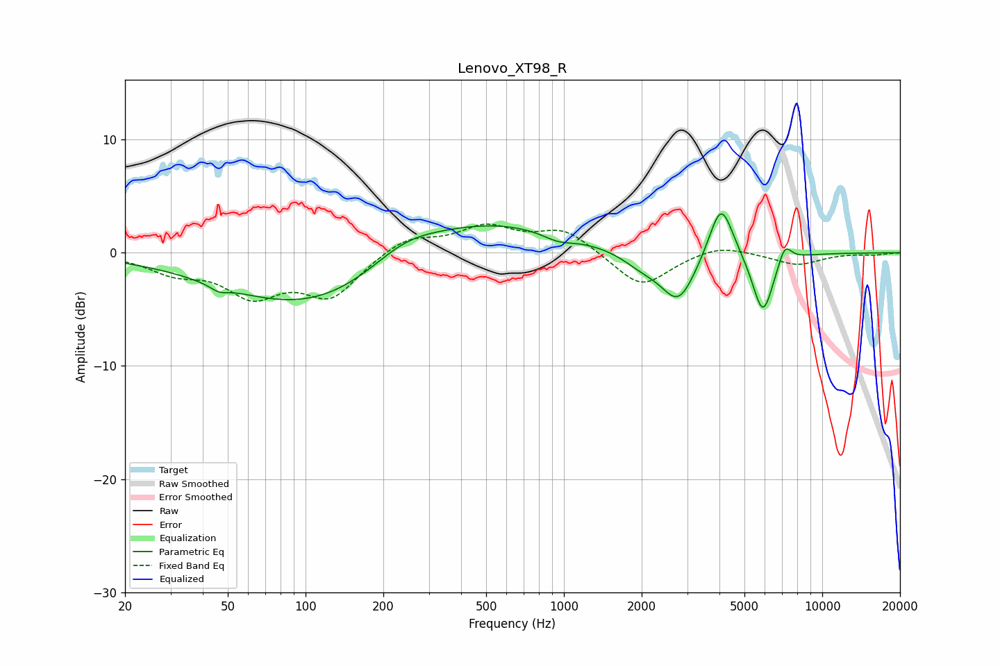

# Lenovo_XT98_R
See [usage instructions](https://github.com/jaakkopasanen/AutoEq#usage) for more options and info.

### Parametric EQs
Apply preamp of -3.5 dB when using parametric equalizer.

|   # | Type    |   Fc (Hz) |    Q |   Gain (dB) |
|-----|---------|-----------|------|-------------|
|   1 | Peaking |        46 | 4.23 |        -0.5 |
|   2 | Peaking |       110 | 0.4  |        -5.2 |
|   3 | Peaking |       240 | 1.05 |         1.7 |
|   4 | Peaking |       446 | 0.43 |         3.4 |
|   5 | Peaking |       950 | 2.31 |        -0.7 |
|   6 | Peaking |      2013 | 1.75 |        -1.2 |
|   7 | Peaking |      2780 | 2.08 |        -4.3 |
|   8 | Peaking |      4058 | 3    |         5.2 |
|   9 | Peaking |      5894 | 3.34 |        -5.6 |
|  10 | Peaking |      7158 | 5.14 |         1.8 |

### Fixed Band EQs
When using fixed band (also called graphic) equalizer, apply preamp of **-2.6 dB** (if available) and set gains manually with these parameters.

|   # | Type    |   Fc (Hz) |    Q |   Gain (dB) |
|-----|---------|-----------|------|-------------|
|   1 | Peaking |        31 | 1.41 |        -1.5 |
|   2 | Peaking |        62 | 1.41 |        -3.4 |
|   3 | Peaking |       125 | 1.41 |        -3.7 |
|   4 | Peaking |       250 | 1.41 |         1.5 |
|   5 | Peaking |       500 | 1.41 |         2.2 |
|   6 | Peaking |      1000 | 1.41 |         2   |
|   7 | Peaking |      2000 | 1.41 |        -3.1 |
|   8 | Peaking |      4000 | 1.41 |         0.8 |
|   9 | Peaking |      8000 | 1.41 |        -1.1 |
|  10 | Peaking |     16000 | 1.41 |        -0.2 |

### Graphs

