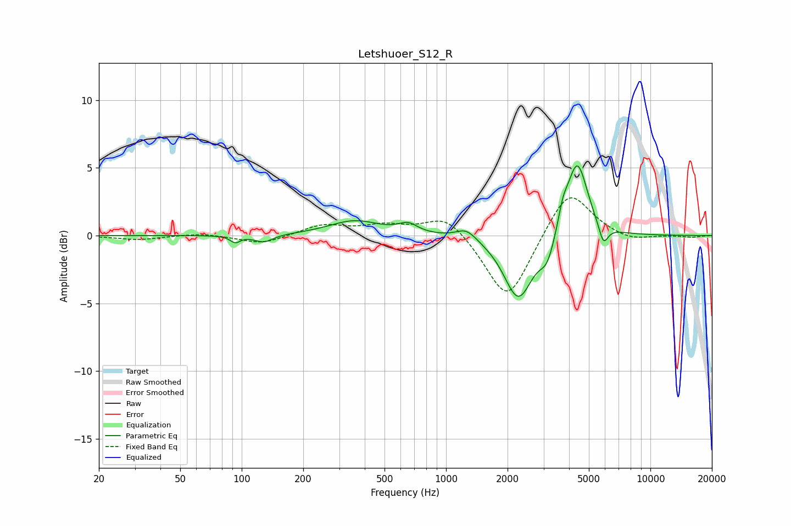

# Letshuoer_S12_R
See [usage instructions](https://github.com/jaakkopasanen/AutoEq#usage) for more options and info.

### Parametric EQs
Apply preamp of -5.2 dB when using parametric equalizer.

|   # | Type    |   Fc (Hz) |    Q |   Gain (dB) |
|-----|---------|-----------|------|-------------|
|   1 | Peaking |        93 | 6    |        -0.5 |
|   2 | Peaking |       128 | 3.13 |        -0.6 |
|   3 | Peaking |       357 | 1.13 |         1.1 |
|   4 | Peaking |       652 | 3.05 |         0.7 |
|   5 | Peaking |      1258 | 2.83 |         0.8 |
|   6 | Peaking |      2259 | 2.01 |        -4.7 |
|   7 | Peaking |      3131 | 3.76 |        -1.7 |
|   8 | Peaking |      3733 | 6    |         1.2 |
|   9 | Peaking |      4382 | 2.72 |         5.7 |
|  10 | Peaking |      5890 | 6    |        -1.5 |

### Fixed Band EQs
When using fixed band (also called graphic) equalizer, apply preamp of **-2.9 dB** (if available) and set gains manually with these parameters.

|   # | Type    |   Fc (Hz) |    Q |   Gain (dB) |
|-----|---------|-----------|------|-------------|
|   1 | Peaking |        31 | 1.41 |        -0.3 |
|   2 | Peaking |        62 | 1.41 |         0.2 |
|   3 | Peaking |       125 | 1.41 |        -0.6 |
|   4 | Peaking |       250 | 1.41 |         0.8 |
|   5 | Peaking |       500 | 1.41 |         0.7 |
|   6 | Peaking |      1000 | 1.41 |         1.6 |
|   7 | Peaking |      2000 | 1.41 |        -5   |
|   8 | Peaking |      4000 | 1.41 |         3.6 |
|   9 | Peaking |      8000 | 1.41 |        -0.4 |
|  10 | Peaking |     16000 | 1.41 |        -0.1 |

### Graphs

