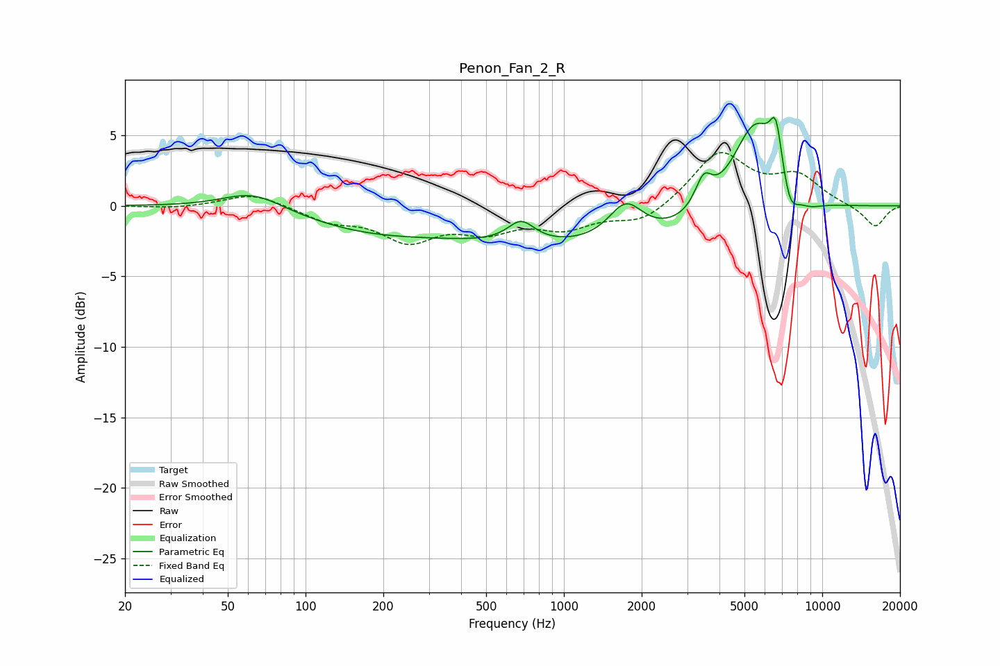

# Penon_Fan_2_R
See [usage instructions](https://github.com/jaakkopasanen/AutoEq#usage) for more options and info.

### Parametric EQs
Apply preamp of -6.4 dB when using parametric equalizer.

|   # | Type    |   Fc (Hz) |    Q |   Gain (dB) |
|-----|---------|-----------|------|-------------|
|   1 | Peaking |        63 | 1.2  |         1.3 |
|   2 | Peaking |       170 | 0.54 |        -1.4 |
|   3 | Peaking |       683 | 2.7  |         1.5 |
|   4 | Peaking |      1449 | 0.22 |        -2.9 |
|   5 | Peaking |      1735 | 2.13 |         2.6 |
|   6 | Peaking |      3473 | 4.22 |         2.1 |
|   7 | Peaking |      5505 | 1.43 |         7.2 |
|   8 | Peaking |      6619 | 5.95 |         3.2 |
|   9 | Peaking |      7505 | 4.17 |        -2.1 |
|  10 | Peaking |      8774 | 2.19 |        -0.8 |

### Fixed Band EQs
When using fixed band (also called graphic) equalizer, apply preamp of **-3.9 dB** (if available) and set gains manually with these parameters.

|   # | Type    |   Fc (Hz) |    Q |   Gain (dB) |
|-----|---------|-----------|------|-------------|
|   1 | Peaking |        31 | 1.41 |        -0.2 |
|   2 | Peaking |        62 | 1.41 |         0.9 |
|   3 | Peaking |       125 | 1.41 |        -1   |
|   4 | Peaking |       250 | 1.41 |        -2.3 |
|   5 | Peaking |       500 | 1.41 |        -1.5 |
|   6 | Peaking |      1000 | 1.41 |        -1.4 |
|   7 | Peaking |      2000 | 1.41 |        -1.2 |
|   8 | Peaking |      4000 | 1.41 |         3.8 |
|   9 | Peaking |      8000 | 1.41 |         2   |
|  10 | Peaking |     16000 | 1.41 |        -1.6 |

### Graphs

