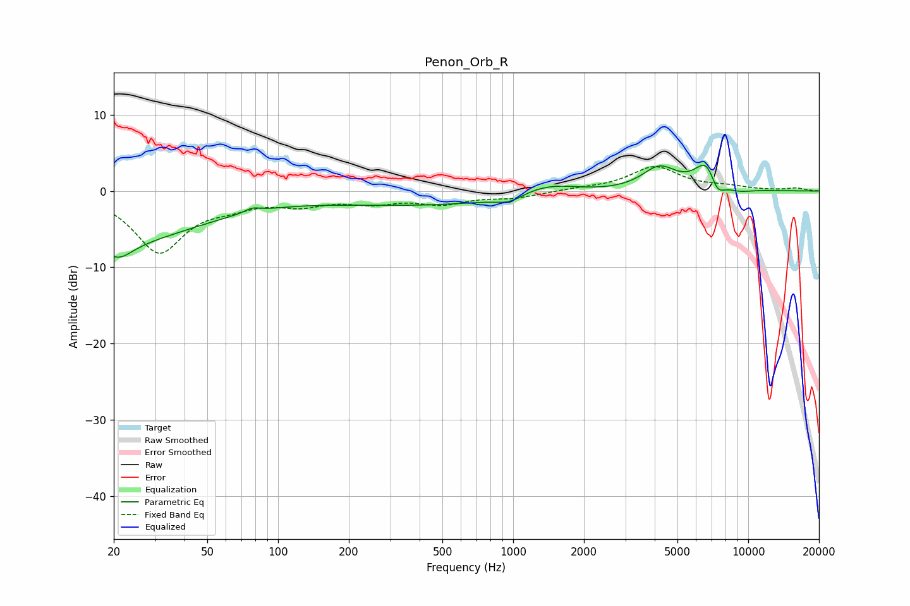

# Penon_Orb_R
See [usage instructions](https://github.com/jaakkopasanen/AutoEq#usage) for more options and info.

### Parametric EQs
Apply preamp of -3.5 dB when using parametric equalizer.

|   # | Type    |   Fc (Hz) |    Q |   Gain (dB) |
|-----|---------|-----------|------|-------------|
|   1 | Peaking |        20 | 0.38 |        -6.5 |
|   2 | Peaking |        21 | 2.37 |        -2.1 |
|   3 | Peaking |        78 | 4.46 |         0.6 |
|   4 | Peaking |       479 | 0.28 |        -1.9 |
|   5 | Peaking |       962 | 2.45 |        -0.9 |
|   6 | Peaking |      1389 | 1.03 |         1.8 |
|   7 | Peaking |      4185 | 1.89 |         3   |
|   8 | Peaking |      6718 | 2.68 |         4.2 |
|   9 | Peaking |      7347 | 3.98 |        -2.8 |
|  10 | Peaking |      9117 | 2.28 |        -0.5 |

### Fixed Band EQs
When using fixed band (also called graphic) equalizer, apply preamp of **-3.3 dB** (if available) and set gains manually with these parameters.

|   # | Type    |   Fc (Hz) |    Q |   Gain (dB) |
|-----|---------|-----------|------|-------------|
|   1 | Peaking |        31 | 1.41 |        -7.9 |
|   2 | Peaking |        62 | 1.41 |        -1.3 |
|   3 | Peaking |       125 | 1.41 |        -1.5 |
|   4 | Peaking |       250 | 1.41 |        -1.3 |
|   5 | Peaking |       500 | 1.41 |        -1.5 |
|   6 | Peaking |      1000 | 1.41 |        -0.8 |
|   7 | Peaking |      2000 | 1.41 |         0.2 |
|   8 | Peaking |      4000 | 1.41 |         3.1 |
|   9 | Peaking |      8000 | 1.41 |         0.5 |
|  10 | Peaking |     16000 | 1.41 |         0.3 |

### Graphs

