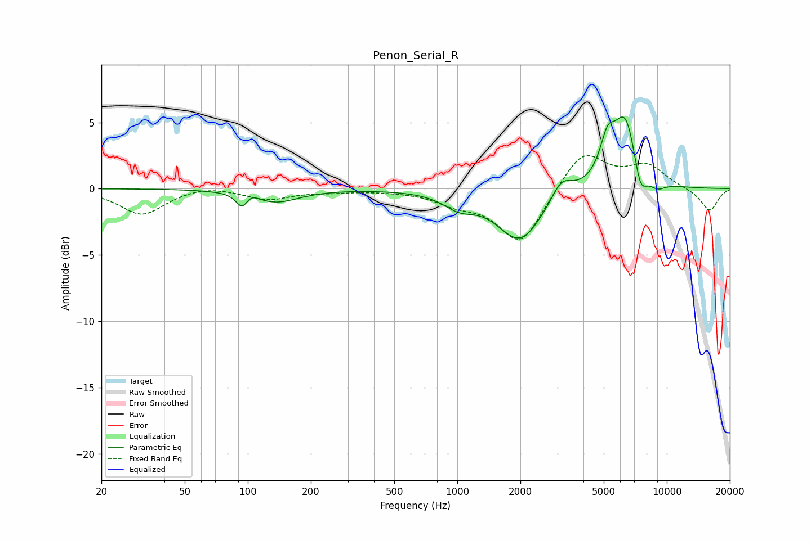

# Penon_Serial_R
See [usage instructions](https://github.com/jaakkopasanen/AutoEq#usage) for more options and info.

### Parametric EQs
Apply preamp of -5.5 dB when using parametric equalizer.

|   # | Type    |   Fc (Hz) |    Q |   Gain (dB) |
|-----|---------|-----------|------|-------------|
|   1 | Peaking |        94 | 5.25 |        -1.1 |
|   2 | Peaking |       103 | 4.44 |         0.4 |
|   3 | Peaking |       136 | 1.3  |        -1   |
|   4 | Peaking |      1020 | 1.88 |        -1   |
|   5 | Peaking |      1992 | 1.31 |        -3.9 |
|   6 | Peaking |      3144 | 2.87 |         1.5 |
|   7 | Peaking |      5204 | 3.95 |         2.5 |
|   8 | Peaking |      6354 | 2.29 |         5.6 |
|   9 | Peaking |      7454 | 4.02 |        -2.5 |
|  10 | Peaking |      8984 | 3.24 |        -0.6 |

### Fixed Band EQs
When using fixed band (also called graphic) equalizer, apply preamp of **-2.6 dB** (if available) and set gains manually with these parameters.

|   # | Type    |   Fc (Hz) |    Q |   Gain (dB) |
|-----|---------|-----------|------|-------------|
|   1 | Peaking |        31 | 1.41 |        -1.9 |
|   2 | Peaking |        62 | 1.41 |         0.3 |
|   3 | Peaking |       125 | 1.41 |        -0.8 |
|   4 | Peaking |       250 | 1.41 |        -0.2 |
|   5 | Peaking |       500 | 1.41 |        -0.1 |
|   6 | Peaking |      1000 | 1.41 |        -0.9 |
|   7 | Peaking |      2000 | 1.41 |        -4.2 |
|   8 | Peaking |      4000 | 1.41 |         3   |
|   9 | Peaking |      8000 | 1.41 |         1.7 |
|  10 | Peaking |     16000 | 1.41 |        -1.7 |

### Graphs

