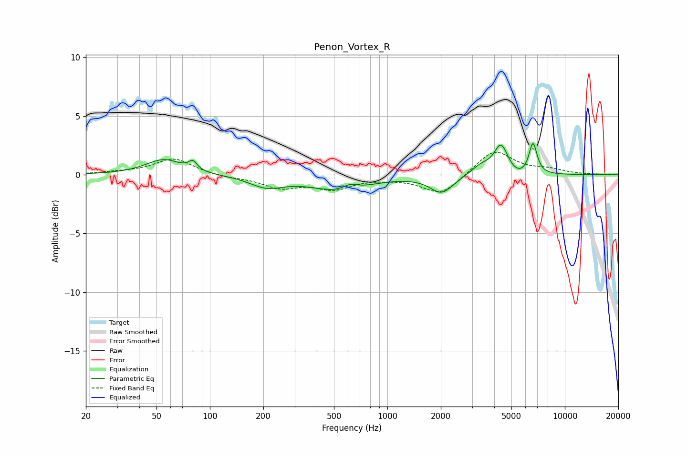

# Penon_Vortex_R
See [usage instructions](https://github.com/jaakkopasanen/AutoEq#usage) for more options and info.

### Parametric EQs
Apply preamp of -2.8 dB when using parametric equalizer.

|   # | Type    |   Fc (Hz) |    Q |   Gain (dB) |
|-----|---------|-----------|------|-------------|
|   1 | Peaking |        55 | 1.39 |         1.3 |
|   2 | Peaking |        80 | 6    |         0.7 |
|   3 | Peaking |       209 | 1.45 |        -0.9 |
|   4 | Peaking |       541 | 0.88 |        -1.3 |
|   5 | Peaking |       617 | 3.4  |         0.5 |
|   6 | Peaking |      2021 | 2.16 |        -1.5 |
|   7 | Peaking |      3371 | 2.49 |         0.8 |
|   8 | Peaking |      4372 | 3.55 |         2.5 |
|   9 | Peaking |      5437 | 2.23 |        -0.5 |
|  10 | Peaking |      6612 | 6    |         2.7 |

### Fixed Band EQs
When using fixed band (also called graphic) equalizer, apply preamp of **-2.0 dB** (if available) and set gains manually with these parameters.

|   # | Type    |   Fc (Hz) |    Q |   Gain (dB) |
|-----|---------|-----------|------|-------------|
|   1 | Peaking |        31 | 1.41 |         0.2 |
|   2 | Peaking |        62 | 1.41 |         1.4 |
|   3 | Peaking |       125 | 1.41 |        -0.2 |
|   4 | Peaking |       250 | 1.41 |        -1   |
|   5 | Peaking |       500 | 1.41 |        -1.1 |
|   6 | Peaking |      1000 | 1.41 |        -0.2 |
|   7 | Peaking |      2000 | 1.41 |        -1.7 |
|   8 | Peaking |      4000 | 1.41 |         2.2 |
|   9 | Peaking |      8000 | 1.41 |         0.4 |
|  10 | Peaking |     16000 | 1.41 |         0   |

### Graphs

