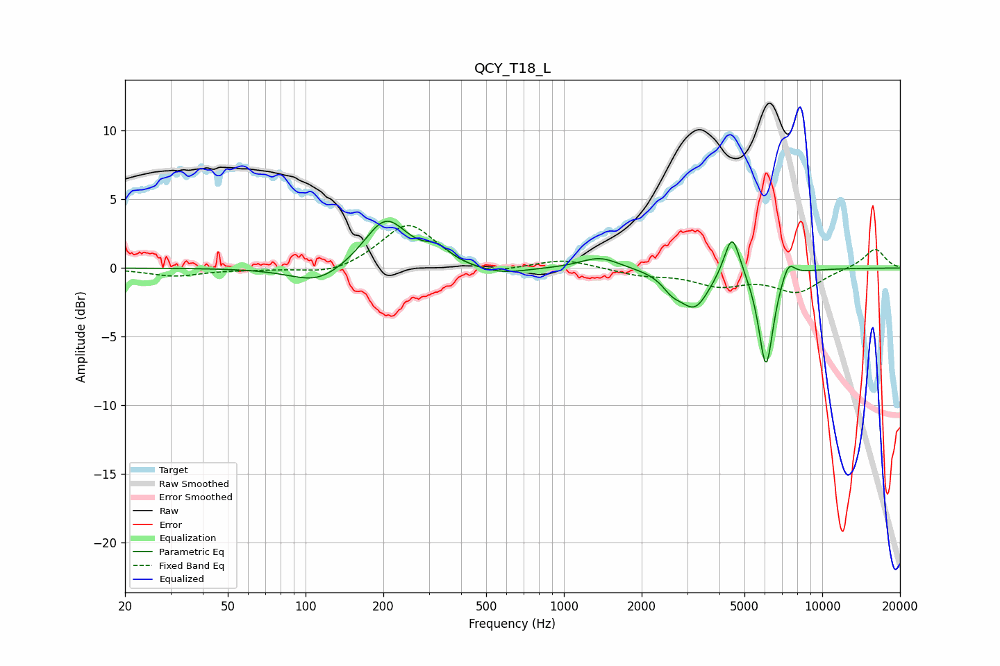

# QCY_T18_L
See [usage instructions](https://github.com/jaakkopasanen/AutoEq#usage) for more options and info.

### Parametric EQs
Apply preamp of -3.5 dB when using parametric equalizer.

|   # | Type    |   Fc (Hz) |    Q |   Gain (dB) |
|-----|---------|-----------|------|-------------|
|   1 | Peaking |       112 | 1.32 |        -1.3 |
|   2 | Peaking |       204 | 1.68 |         3.7 |
|   3 | Peaking |       325 | 2.92 |         1   |
|   4 | Peaking |       573 | 1.43 |        -0.5 |
|   5 | Peaking |      1377 | 1.91 |         0.9 |
|   6 | Peaking |      2621 | 3.76 |        -0.9 |
|   7 | Peaking |      3207 | 2.43 |        -2.8 |
|   8 | Peaking |      4478 | 4.54 |         3.3 |
|   9 | Peaking |      6058 | 4.81 |        -7.2 |
|  10 | Peaking |      7392 | 5.32 |         1.3 |

### Fixed Band EQs
When using fixed band (also called graphic) equalizer, apply preamp of **-3.2 dB** (if available) and set gains manually with these parameters.

|   # | Type    |   Fc (Hz) |    Q |   Gain (dB) |
|-----|---------|-----------|------|-------------|
|   1 | Peaking |        31 | 1.41 |        -0.6 |
|   2 | Peaking |        62 | 1.41 |        -0.1 |
|   3 | Peaking |       125 | 1.41 |        -0.6 |
|   4 | Peaking |       250 | 1.41 |         3.3 |
|   5 | Peaking |       500 | 1.41 |        -0.7 |
|   6 | Peaking |      1000 | 1.41 |         0.6 |
|   7 | Peaking |      2000 | 1.41 |        -0.5 |
|   8 | Peaking |      4000 | 1.41 |        -1.1 |
|   9 | Peaking |      8000 | 1.41 |        -1.7 |
|  10 | Peaking |     16000 | 1.41 |         1.4 |

### Graphs

