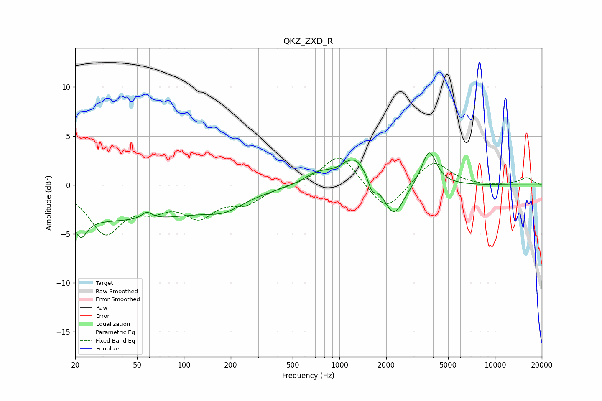

# QKZ_ZXD_R
See [usage instructions](https://github.com/jaakkopasanen/AutoEq#usage) for more options and info.

### Parametric EQs
Apply preamp of -3.4 dB when using parametric equalizer.

|   # | Type    |   Fc (Hz) |    Q |   Gain (dB) |
|-----|---------|-----------|------|-------------|
|   1 | Peaking |        22 | 3.84 |        -1.9 |
|   2 | Peaking |        35 | 0.18 |        -3.6 |
|   3 | Peaking |        58 | 4.28 |         0.7 |
|   4 | Peaking |       184 | 1.31 |        -0.9 |
|   5 | Peaking |       729 | 1.52 |         1.1 |
|   6 | Peaking |      1253 | 1.68 |         2.8 |
|   7 | Peaking |      1619 | 5.8  |        -1.3 |
|   8 | Peaking |      2236 | 2.24 |        -3.5 |
|   9 | Peaking |      3773 | 3    |         3.6 |
|  10 | Peaking |      9933 | 6    |         0   |

### Fixed Band EQs
When using fixed band (also called graphic) equalizer, apply preamp of **-2.8 dB** (if available) and set gains manually with these parameters.

|   # | Type    |   Fc (Hz) |    Q |   Gain (dB) |
|-----|---------|-----------|------|-------------|
|   1 | Peaking |        31 | 1.41 |        -4.7 |
|   2 | Peaking |        62 | 1.41 |        -1.7 |
|   3 | Peaking |       125 | 1.41 |        -2.8 |
|   4 | Peaking |       250 | 1.41 |        -1.6 |
|   5 | Peaking |       500 | 1.41 |         0   |
|   6 | Peaking |      1000 | 1.41 |         3.2 |
|   7 | Peaking |      2000 | 1.41 |        -2.9 |
|   8 | Peaking |      4000 | 1.41 |         2.6 |
|   9 | Peaking |      8000 | 1.41 |        -0.1 |
|  10 | Peaking |     16000 | 1.41 |         0.7 |

### Graphs

