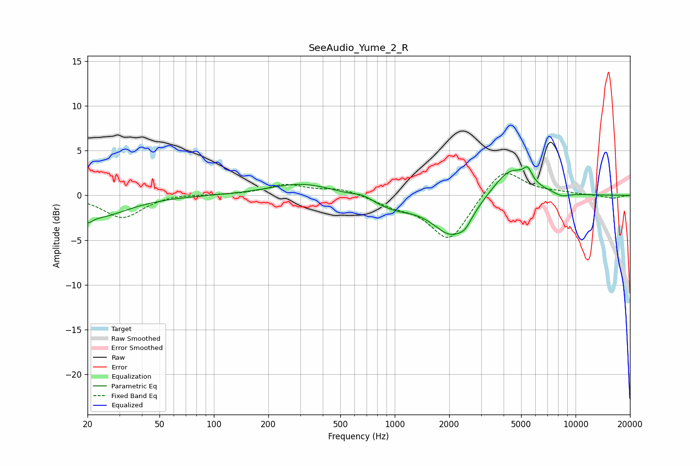

# SeeAudio_Yume_2_R
See [usage instructions](https://github.com/jaakkopasanen/AutoEq#usage) for more options and info.

### Parametric EQs
Apply preamp of -3.3 dB when using parametric equalizer.

|   # | Type    |   Fc (Hz) |    Q |   Gain (dB) |
|-----|---------|-----------|------|-------------|
|   1 | Peaking |        20 | 5.62 |        -0.8 |
|   2 | Peaking |        23 | 0.86 |        -2.3 |
|   3 | Peaking |       307 | 0.8  |         1.4 |
|   4 | Peaking |       671 | 2.91 |         0.4 |
|   5 | Peaking |       991 | 1.15 |        -1.3 |
|   6 | Peaking |      2056 | 1.35 |        -4.3 |
|   7 | Peaking |      2454 | 3.74 |        -0.9 |
|   8 | Peaking |      4385 | 1.41 |         3.3 |
|   9 | Peaking |      5439 | 5.97 |         1.3 |
|  10 | Peaking |      8386 | 3.09 |        -0.5 |

### Fixed Band EQs
When using fixed band (also called graphic) equalizer, apply preamp of **-2.5 dB** (if available) and set gains manually with these parameters.

|   # | Type    |   Fc (Hz) |    Q |   Gain (dB) |
|-----|---------|-----------|------|-------------|
|   1 | Peaking |        31 | 1.41 |        -2.5 |
|   2 | Peaking |        62 | 1.41 |         0.2 |
|   3 | Peaking |       125 | 1.41 |         0.1 |
|   4 | Peaking |       250 | 1.41 |         1.2 |
|   5 | Peaking |       500 | 1.41 |         0.8 |
|   6 | Peaking |      1000 | 1.41 |        -0.9 |
|   7 | Peaking |      2000 | 1.41 |        -5.1 |
|   8 | Peaking |      4000 | 1.41 |         3.3 |
|   9 | Peaking |      8000 | 1.41 |         0.3 |
|  10 | Peaking |     16000 | 1.41 |        -0.3 |

### Graphs

