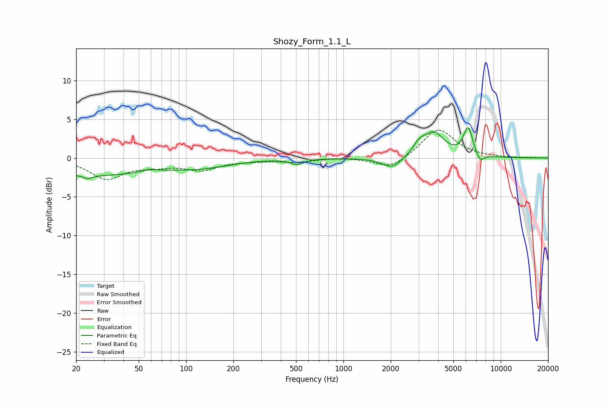

# Shozy_Form_1.1_L
See [usage instructions](https://github.com/jaakkopasanen/AutoEq#usage) for more options and info.

### Parametric EQs
Apply preamp of -4.0 dB when using parametric equalizer.

|   # | Type    |   Fc (Hz) |    Q |   Gain (dB) |
|-----|---------|-----------|------|-------------|
|   1 | Peaking |        24 | 4.87 |        -0.4 |
|   2 | Peaking |        25 | 0.35 |        -2.2 |
|   3 | Peaking |        59 | 3.58 |         0.4 |
|   4 | Peaking |       128 | 0.77 |        -0.9 |
|   5 | Peaking |       509 | 3.48 |        -0.7 |
|   6 | Peaking |      2041 | 2.21 |        -1.5 |
|   7 | Peaking |      3027 | 3.76 |         1.2 |
|   8 | Peaking |      3753 | 2.11 |         3.1 |
|   9 | Peaking |      6207 | 4.69 |         3.7 |
|  10 | Peaking |      7382 | 5.22 |        -1.1 |

### Fixed Band EQs
When using fixed band (also called graphic) equalizer, apply preamp of **-3.7 dB** (if available) and set gains manually with these parameters.

|   # | Type    |   Fc (Hz) |    Q |   Gain (dB) |
|-----|---------|-----------|------|-------------|
|   1 | Peaking |        31 | 1.41 |        -2.6 |
|   2 | Peaking |        62 | 1.41 |        -0.8 |
|   3 | Peaking |       125 | 1.41 |        -1.4 |
|   4 | Peaking |       250 | 1.41 |        -0.2 |
|   5 | Peaking |       500 | 1.41 |        -0.5 |
|   6 | Peaking |      1000 | 1.41 |         0.1 |
|   7 | Peaking |      2000 | 1.41 |        -1.5 |
|   8 | Peaking |      4000 | 1.41 |         3.8 |
|   9 | Peaking |      8000 | 1.41 |         0   |
|  10 | Peaking |     16000 | 1.41 |         0   |

### Graphs

