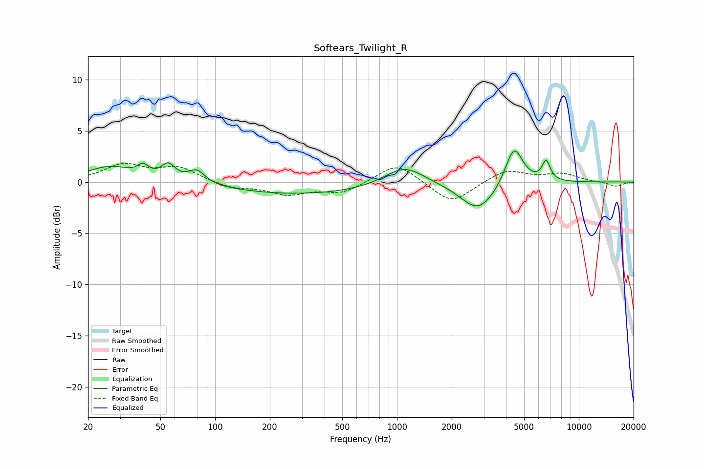

# Softears_Twilight_R
See [usage instructions](https://github.com/jaakkopasanen/AutoEq#usage) for more options and info.

### Parametric EQs
Apply preamp of -3.1 dB when using parametric equalizer.

|   # | Type    |   Fc (Hz) |    Q |   Gain (dB) |
|-----|---------|-----------|------|-------------|
|   1 | Peaking |        26 | 1.1  |         1.5 |
|   2 | Peaking |        40 | 4.78 |         0.9 |
|   3 | Peaking |        55 | 3.71 |         1.5 |
|   4 | Peaking |        79 | 3.03 |         1.3 |
|   5 | Peaking |       302 | 0.34 |        -1.2 |
|   6 | Peaking |      1097 | 1.29 |         2   |
|   7 | Peaking |      2775 | 1.48 |        -2.4 |
|   8 | Peaking |      2985 | 1.31 |        -0.5 |
|   9 | Peaking |      4397 | 2.85 |         3.9 |
|  10 | Peaking |      6613 | 6    |         1.9 |

### Fixed Band EQs
When using fixed band (also called graphic) equalizer, apply preamp of **-1.9 dB** (if available) and set gains manually with these parameters.

|   # | Type    |   Fc (Hz) |    Q |   Gain (dB) |
|-----|---------|-----------|------|-------------|
|   1 | Peaking |        31 | 1.41 |         1.6 |
|   2 | Peaking |        62 | 1.41 |         1.4 |
|   3 | Peaking |       125 | 1.41 |        -0.6 |
|   4 | Peaking |       250 | 1.41 |        -1.1 |
|   5 | Peaking |       500 | 1.41 |        -1   |
|   6 | Peaking |      1000 | 1.41 |         1.9 |
|   7 | Peaking |      2000 | 1.41 |        -2.2 |
|   8 | Peaking |      4000 | 1.41 |         1.2 |
|   9 | Peaking |      8000 | 1.41 |         0.8 |
|  10 | Peaking |     16000 | 1.41 |        -0.4 |

### Graphs

