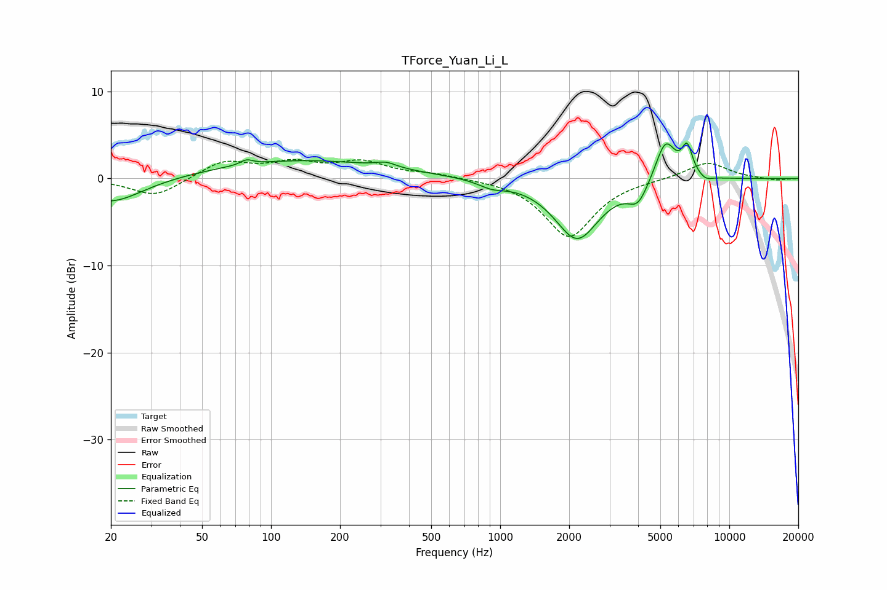

# TForce_Yuan_Li_L
See [usage instructions](https://github.com/jaakkopasanen/AutoEq#usage) for more options and info.

### Parametric EQs
Apply preamp of -4.2 dB when using parametric equalizer.

|   # | Type    |   Fc (Hz) |    Q |   Gain (dB) |
|-----|---------|-----------|------|-------------|
|   1 | Peaking |        20 | 1.02 |        -2.9 |
|   2 | Peaking |        78 | 5.46 |         0.6 |
|   3 | Peaking |       135 | 0.36 |         2.1 |
|   4 | Peaking |       318 | 3.19 |         0.6 |
|   5 | Peaking |       920 | 2.42 |        -0.7 |
|   6 | Peaking |      2168 | 1.44 |        -6.9 |
|   7 | Peaking |      3993 | 3.26 |        -2.3 |
|   8 | Peaking |      5265 | 3.11 |         4.8 |
|   9 | Peaking |      6548 | 5.84 |         3.3 |
|  10 | Peaking |      7879 | 4.8  |        -0.5 |

### Fixed Band EQs
When using fixed band (also called graphic) equalizer, apply preamp of **-2.3 dB** (if available) and set gains manually with these parameters.

|   # | Type    |   Fc (Hz) |    Q |   Gain (dB) |
|-----|---------|-----------|------|-------------|
|   1 | Peaking |        31 | 1.41 |        -2.1 |
|   2 | Peaking |        62 | 1.41 |         2   |
|   3 | Peaking |       125 | 1.41 |         1.6 |
|   4 | Peaking |       250 | 1.41 |         1.8 |
|   5 | Peaking |       500 | 1.41 |         0.5 |
|   6 | Peaking |      1000 | 1.41 |         0   |
|   7 | Peaking |      2000 | 1.41 |        -6.7 |
|   8 | Peaking |      4000 | 1.41 |        -0   |
|   9 | Peaking |      8000 | 1.41 |         1.9 |
|  10 | Peaking |     16000 | 1.41 |        -0.2 |

### Graphs

