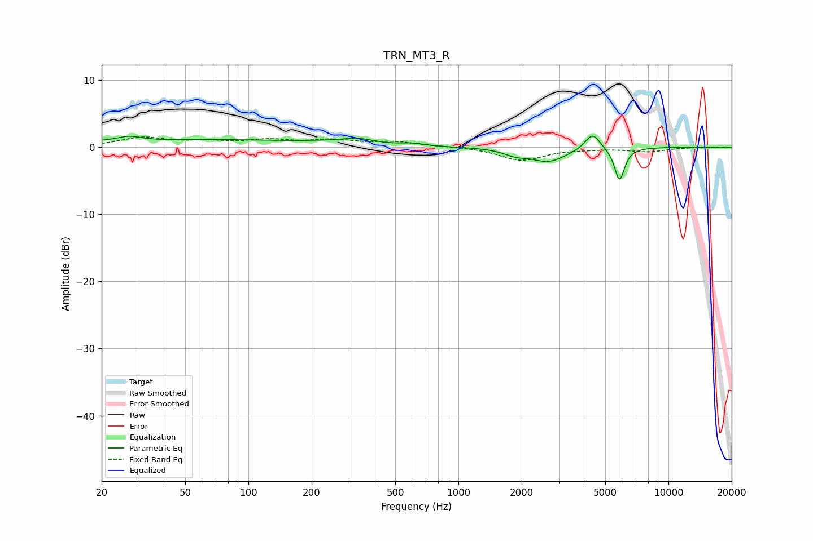

# TRN_MT3_R
See [usage instructions](https://github.com/jaakkopasanen/AutoEq#usage) for more options and info.

### Parametric EQs
Apply preamp of -1.7 dB when using parametric equalizer.

|   # | Type    |   Fc (Hz) |    Q |   Gain (dB) |
|-----|---------|-----------|------|-------------|
|   1 | Peaking |        27 | 2.81 |         0.6 |
|   2 | Peaking |        39 | 4.86 |        -0.1 |
|   3 | Peaking |        48 | 0.26 |         1.1 |
|   4 | Peaking |       247 | 0.83 |         0.4 |
|   5 | Peaking |       334 | 1.86 |         0.7 |
|   6 | Peaking |       609 | 2.72 |         0.4 |
|   7 | Peaking |      1870 | 2.56 |        -0.8 |
|   8 | Peaking |      2689 | 1.69 |        -2.1 |
|   9 | Peaking |      4353 | 3.96 |         2.5 |
|  10 | Peaking |      5847 | 5.76 |        -4.9 |

### Fixed Band EQs
When using fixed band (also called graphic) equalizer, apply preamp of **-1.6 dB** (if available) and set gains manually with these parameters.

|   # | Type    |   Fc (Hz) |    Q |   Gain (dB) |
|-----|---------|-----------|------|-------------|
|   1 | Peaking |        31 | 1.41 |         1.3 |
|   2 | Peaking |        62 | 1.41 |         0.7 |
|   3 | Peaking |       125 | 1.41 |         0.9 |
|   4 | Peaking |       250 | 1.41 |         0.9 |
|   5 | Peaking |       500 | 1.41 |         0.7 |
|   6 | Peaking |      1000 | 1.41 |         0.1 |
|   7 | Peaking |      2000 | 1.41 |        -2   |
|   8 | Peaking |      4000 | 1.41 |        -0.2 |
|   9 | Peaking |      8000 | 1.41 |        -0.6 |
|  10 | Peaking |     16000 | 1.41 |         0   |

### Graphs

