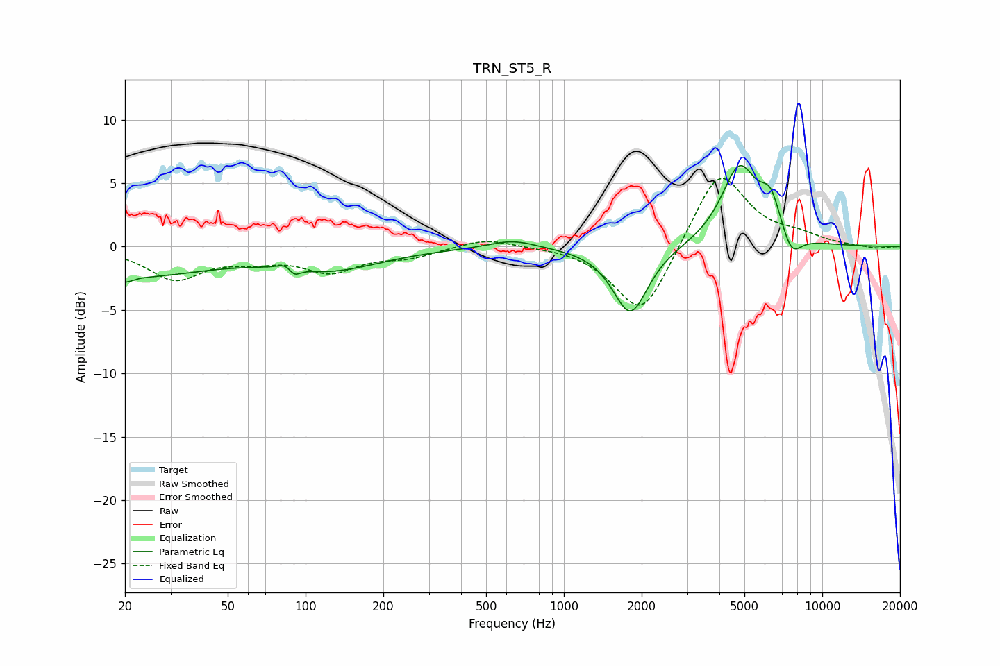

# TRN_ST5_R
See [usage instructions](https://github.com/jaakkopasanen/AutoEq#usage) for more options and info.

### Parametric EQs
Apply preamp of -6.5 dB when using parametric equalizer.

|   # | Type    |   Fc (Hz) |    Q |   Gain (dB) |
|-----|---------|-----------|------|-------------|
|   1 | Peaking |        20 | 5.1  |        -0.5 |
|   2 | Peaking |        22 | 0.51 |        -2.2 |
|   3 | Peaking |        88 | 4.29 |         1.8 |
|   4 | Peaking |        89 | 5.29 |        -2   |
|   5 | Peaking |       122 | 0.7  |        -1.7 |
|   6 | Peaking |       634 | 1.56 |         0.7 |
|   7 | Peaking |      1810 | 2.09 |        -5.4 |
|   8 | Peaking |      4777 | 1.99 |         6.2 |
|   9 | Peaking |      6313 | 3.34 |         2.9 |
|  10 | Peaking |      7590 | 3.44 |        -1.9 |

### Fixed Band EQs
When using fixed band (also called graphic) equalizer, apply preamp of **-5.5 dB** (if available) and set gains manually with these parameters.

|   # | Type    |   Fc (Hz) |    Q |   Gain (dB) |
|-----|---------|-----------|------|-------------|
|   1 | Peaking |        31 | 1.41 |        -2.5 |
|   2 | Peaking |        62 | 1.41 |        -0.8 |
|   3 | Peaking |       125 | 1.41 |        -1.8 |
|   4 | Peaking |       250 | 1.41 |        -0.7 |
|   5 | Peaking |       500 | 1.41 |         0.7 |
|   6 | Peaking |      1000 | 1.41 |         0.1 |
|   7 | Peaking |      2000 | 1.41 |        -5.7 |
|   8 | Peaking |      4000 | 1.41 |         6.3 |
|   9 | Peaking |      8000 | 1.41 |         0.7 |
|  10 | Peaking |     16000 | 1.41 |        -0.2 |

### Graphs

