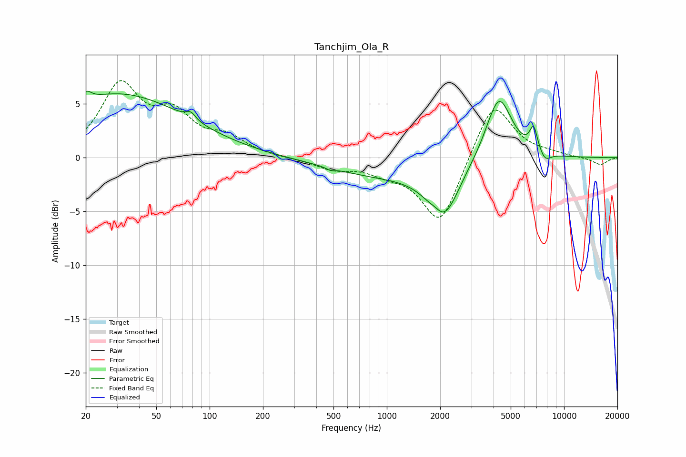

# Tanchjim_Ola_R
See [usage instructions](https://github.com/jaakkopasanen/AutoEq#usage) for more options and info.

### Parametric EQs
Apply preamp of -6.3 dB when using parametric equalizer.

|   # | Type    |   Fc (Hz) |    Q |   Gain (dB) |
|-----|---------|-----------|------|-------------|
|   1 | Peaking |        20 | 5.61 |         0.8 |
|   2 | Peaking |        30 | 0.36 |         5.9 |
|   3 | Peaking |        78 | 5.4  |         0.7 |
|   4 | Peaking |       481 | 6    |        -0.2 |
|   5 | Peaking |       940 | 0.48 |        -1.5 |
|   6 | Peaking |      1894 | 3.85 |         0.6 |
|   7 | Peaking |      2071 | 1.6  |        -5.2 |
|   8 | Peaking |      4286 | 1.89 |         6.1 |
|   9 | Peaking |      6738 | 6    |         2.2 |
|  10 | Peaking |      7801 | 4.03 |        -0.9 |

### Fixed Band EQs
When using fixed band (also called graphic) equalizer, apply preamp of **-7.3 dB** (if available) and set gains manually with these parameters.

|   # | Type    |   Fc (Hz) |    Q |   Gain (dB) |
|-----|---------|-----------|------|-------------|
|   1 | Peaking |        31 | 1.41 |         6.5 |
|   2 | Peaking |        62 | 1.41 |         3.4 |
|   3 | Peaking |       125 | 1.41 |         1.6 |
|   4 | Peaking |       250 | 1.41 |        -0   |
|   5 | Peaking |       500 | 1.41 |        -0.9 |
|   6 | Peaking |      1000 | 1.41 |        -1   |
|   7 | Peaking |      2000 | 1.41 |        -6.3 |
|   8 | Peaking |      4000 | 1.41 |         5.5 |
|   9 | Peaking |      8000 | 1.41 |         0.3 |
|  10 | Peaking |     16000 | 1.41 |        -0.7 |

### Graphs

