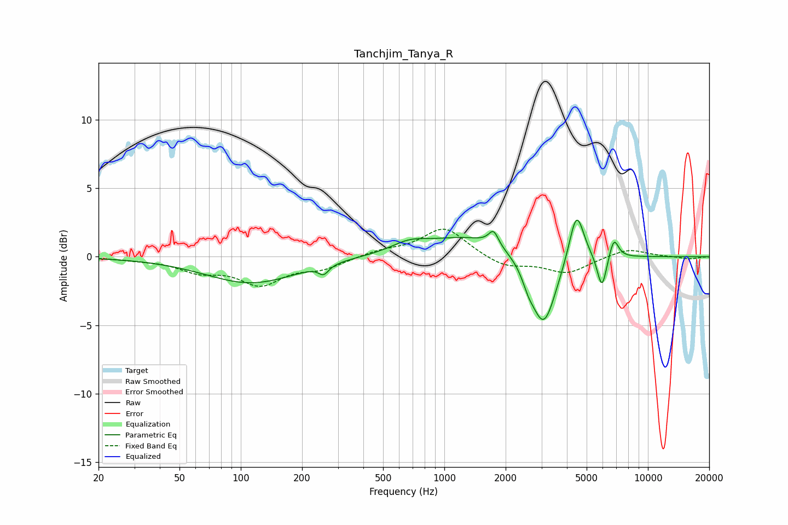

# Tanchjim_Tanya_R
See [usage instructions](https://github.com/jaakkopasanen/AutoEq#usage) for more options and info.

### Parametric EQs
Apply preamp of -2.8 dB when using parametric equalizer.

|   # | Type    |   Fc (Hz) |    Q |   Gain (dB) |
|-----|---------|-----------|------|-------------|
|   1 | Peaking |       112 | 0.63 |        -1.9 |
|   2 | Peaking |       255 | 5.8  |        -0.7 |
|   3 | Peaking |       671 | 1.7  |         0.6 |
|   4 | Peaking |      1365 | 0.61 |         1.5 |
|   5 | Peaking |      1745 | 6    |         1.1 |
|   6 | Peaking |      2580 | 5.18 |        -0.7 |
|   7 | Peaking |      3071 | 2.25 |        -5.5 |
|   8 | Peaking |      4460 | 3.84 |         3.8 |
|   9 | Peaking |      5943 | 5.98 |        -2.5 |
|  10 | Peaking |      6803 | 6    |         1.5 |

### Fixed Band EQs
When using fixed band (also called graphic) equalizer, apply preamp of **-2.1 dB** (if available) and set gains manually with these parameters.

|   # | Type    |   Fc (Hz) |    Q |   Gain (dB) |
|-----|---------|-----------|------|-------------|
|   1 | Peaking |        31 | 1.41 |        -0.1 |
|   2 | Peaking |        62 | 1.41 |        -0.9 |
|   3 | Peaking |       125 | 1.41 |        -1.9 |
|   4 | Peaking |       250 | 1.41 |        -0.8 |
|   5 | Peaking |       500 | 1.41 |         0.4 |
|   6 | Peaking |      1000 | 1.41 |         2.1 |
|   7 | Peaking |      2000 | 1.41 |        -0.8 |
|   8 | Peaking |      4000 | 1.41 |        -1.2 |
|   9 | Peaking |      8000 | 1.41 |         0.6 |
|  10 | Peaking |     16000 | 1.41 |        -0.2 |

### Graphs

