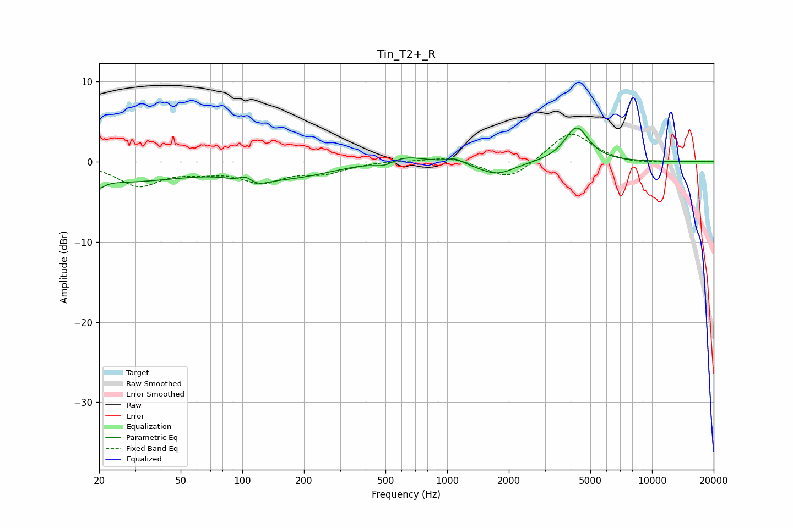

# Tin_T2+_R
See [usage instructions](https://github.com/jaakkopasanen/AutoEq#usage) for more options and info.

### Parametric EQs
Apply preamp of -4.3 dB when using parametric equalizer.

|   # | Type    |   Fc (Hz) |    Q |   Gain (dB) |
|-----|---------|-----------|------|-------------|
|   1 | Peaking |        20 | 5.37 |        -0.9 |
|   2 | Peaking |        25 | 0.43 |        -2.4 |
|   3 | Peaking |       105 | 3.63 |         1.8 |
|   4 | Peaking |       109 | 2.17 |        -2.3 |
|   5 | Peaking |       180 | 0.73 |        -1.6 |
|   6 | Peaking |       496 | 2.78 |        -0.9 |
|   7 | Peaking |       585 | 1.31 |         1.1 |
|   8 | Peaking |      1093 | 3.79 |         0.6 |
|   9 | Peaking |      1748 | 1.61 |        -1.6 |
|  10 | Peaking |      4287 | 2.43 |         4.3 |

### Fixed Band EQs
When using fixed band (also called graphic) equalizer, apply preamp of **-3.5 dB** (if available) and set gains manually with these parameters.

|   # | Type    |   Fc (Hz) |    Q |   Gain (dB) |
|-----|---------|-----------|------|-------------|
|   1 | Peaking |        31 | 1.41 |        -2.9 |
|   2 | Peaking |        62 | 1.41 |        -0.9 |
|   3 | Peaking |       125 | 1.41 |        -2.3 |
|   4 | Peaking |       250 | 1.41 |        -1.2 |
|   5 | Peaking |       500 | 1.41 |         0.1 |
|   6 | Peaking |      1000 | 1.41 |         0.7 |
|   7 | Peaking |      2000 | 1.41 |        -2.4 |
|   8 | Peaking |      4000 | 1.41 |         3.8 |
|   9 | Peaking |      8000 | 1.41 |        -0.3 |
|  10 | Peaking |     16000 | 1.41 |         0.1 |

### Graphs

