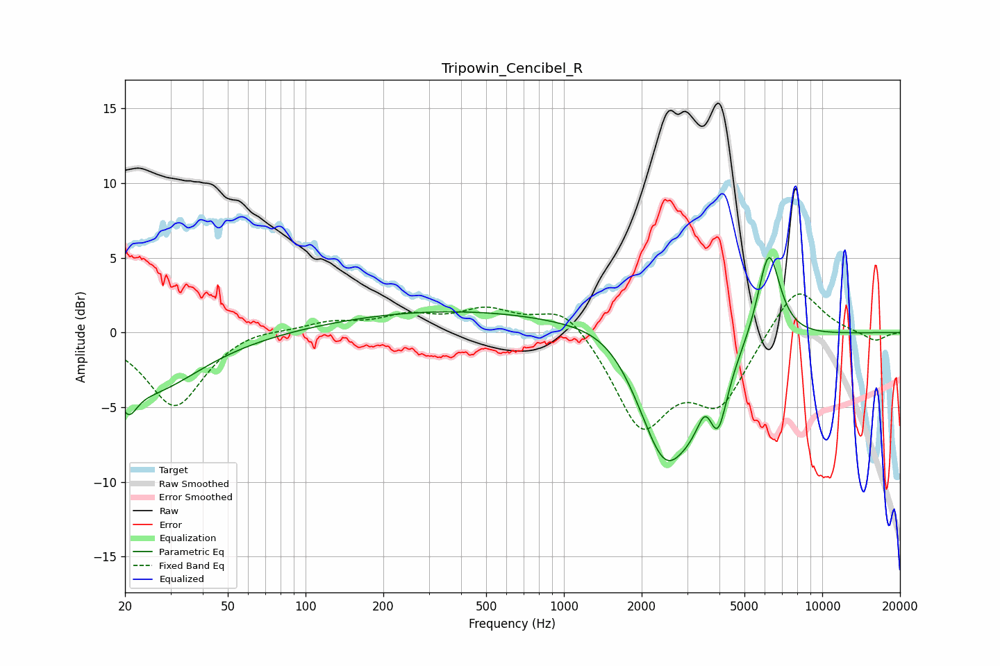

# Tripowin_Cencibel_R
See [usage instructions](https://github.com/jaakkopasanen/AutoEq#usage) for more options and info.

### Parametric EQs
Apply preamp of -5.1 dB when using parametric equalizer.

|   # | Type    |   Fc (Hz) |    Q |   Gain (dB) |
|-----|---------|-----------|------|-------------|
|   1 | Peaking |        21 | 4.32 |        -1.9 |
|   2 | Peaking |        25 | 0.72 |        -3.9 |
|   3 | Peaking |       381 | 0.3  |         1.5 |
|   4 | Peaking |      1612 | 0.93 |         1.9 |
|   5 | Peaking |      2444 | 1.17 |        -8.9 |
|   6 | Peaking |      2548 | 2.38 |        -0.6 |
|   7 | Peaking |      3169 | 2.6  |        -1.3 |
|   8 | Peaking |      3530 | 4.65 |         1.3 |
|   9 | Peaking |      3947 | 3.93 |        -3.8 |
|  10 | Peaking |      6209 | 3.08 |         6.3 |

### Fixed Band EQs
When using fixed band (also called graphic) equalizer, apply preamp of **-2.7 dB** (if available) and set gains manually with these parameters.

|   # | Type    |   Fc (Hz) |    Q |   Gain (dB) |
|-----|---------|-----------|------|-------------|
|   1 | Peaking |        31 | 1.41 |        -5   |
|   2 | Peaking |        62 | 1.41 |         0.4 |
|   3 | Peaking |       125 | 1.41 |         0.6 |
|   4 | Peaking |       250 | 1.41 |         1   |
|   5 | Peaking |       500 | 1.41 |         1.4 |
|   6 | Peaking |      1000 | 1.41 |         2   |
|   7 | Peaking |      2000 | 1.41 |        -6.2 |
|   8 | Peaking |      4000 | 1.41 |        -4.4 |
|   9 | Peaking |      8000 | 1.41 |         3.4 |
|  10 | Peaking |     16000 | 1.41 |        -0.6 |

### Graphs

