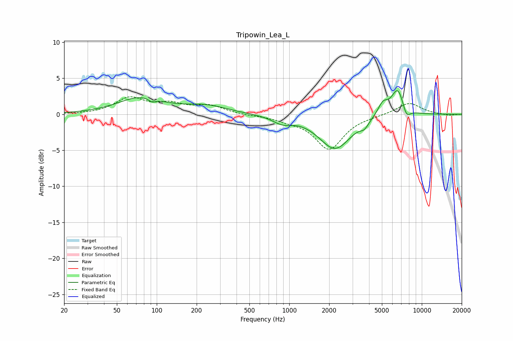

# Tripowin_Lea_L
See [usage instructions](https://github.com/jaakkopasanen/AutoEq#usage) for more options and info.

### Parametric EQs
Apply preamp of -3.4 dB when using parametric equalizer.

|   # | Type    |   Fc (Hz) |    Q |   Gain (dB) |
|-----|---------|-----------|------|-------------|
|   1 | Peaking |        75 | 0.84 |         2.2 |
|   2 | Peaking |        92 | 5.45 |        -0.5 |
|   3 | Peaking |       235 | 0.88 |         1.1 |
|   4 | Peaking |       890 | 1.87 |        -1   |
|   5 | Peaking |      1148 | 2.8  |         0.1 |
|   6 | Peaking |      2214 | 1.18 |        -4.8 |
|   7 | Peaking |      3689 | 4.67 |        -0.8 |
|   8 | Peaking |      5082 | 3.49 |         1.7 |
|   9 | Peaking |      6595 | 2.81 |         3.8 |
|  10 | Peaking |      7645 | 4.47 |        -1.6 |

### Fixed Band EQs
When using fixed band (also called graphic) equalizer, apply preamp of **-2.5 dB** (if available) and set gains manually with these parameters.

|   # | Type    |   Fc (Hz) |    Q |   Gain (dB) |
|-----|---------|-----------|------|-------------|
|   1 | Peaking |        31 | 1.41 |        -0   |
|   2 | Peaking |        62 | 1.41 |         2.2 |
|   3 | Peaking |       125 | 1.41 |         1.2 |
|   4 | Peaking |       250 | 1.41 |         1.1 |
|   5 | Peaking |       500 | 1.41 |        -0.1 |
|   6 | Peaking |      1000 | 1.41 |        -0.6 |
|   7 | Peaking |      2000 | 1.41 |        -4.8 |
|   8 | Peaking |      4000 | 1.41 |        -0.1 |
|   9 | Peaking |      8000 | 1.41 |         1.6 |
|  10 | Peaking |     16000 | 1.41 |        -0.2 |

### Graphs

