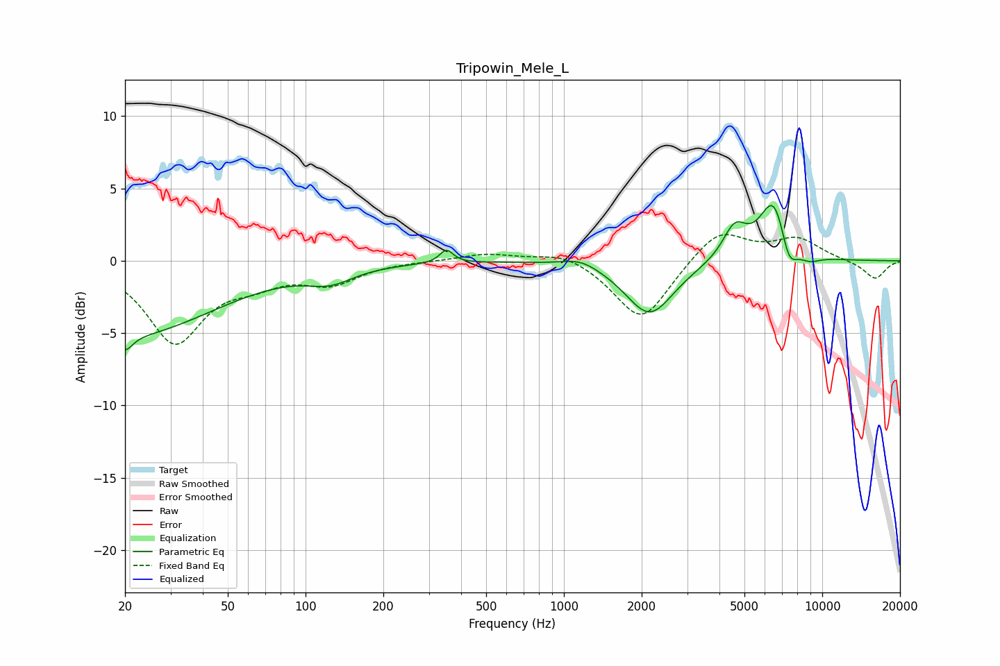

# Tripowin_Mele_L
See [usage instructions](https://github.com/jaakkopasanen/AutoEq#usage) for more options and info.

### Parametric EQs
Apply preamp of -3.9 dB when using parametric equalizer.

|   # | Type    |   Fc (Hz) |    Q |   Gain (dB) |
|-----|---------|-----------|------|-------------|
|   1 | Peaking |        20 | 0.41 |        -5.1 |
|   2 | Peaking |        20 | 5.13 |        -1   |
|   3 | Peaking |       125 | 1.58 |        -1   |
|   4 | Peaking |       351 | 5.54 |         0.9 |
|   5 | Peaking |      1161 | 1.97 |         0.6 |
|   6 | Peaking |      2148 | 1.52 |        -3.8 |
|   7 | Peaking |      4582 | 2.97 |         2.2 |
|   8 | Peaking |      6524 | 2.42 |         4.5 |
|   9 | Peaking |      7408 | 4.02 |        -2.3 |
|  10 | Peaking |      8878 | 2.9  |        -0.5 |

### Fixed Band EQs
When using fixed band (also called graphic) equalizer, apply preamp of **-1.9 dB** (if available) and set gains manually with these parameters.

|   # | Type    |   Fc (Hz) |    Q |   Gain (dB) |
|-----|---------|-----------|------|-------------|
|   1 | Peaking |        31 | 1.41 |        -5.5 |
|   2 | Peaking |        62 | 1.41 |        -1.1 |
|   3 | Peaking |       125 | 1.41 |        -1.4 |
|   4 | Peaking |       250 | 1.41 |         0   |
|   5 | Peaking |       500 | 1.41 |         0.5 |
|   6 | Peaking |      1000 | 1.41 |         0.7 |
|   7 | Peaking |      2000 | 1.41 |        -4.2 |
|   8 | Peaking |      4000 | 1.41 |         2.3 |
|   9 | Peaking |      8000 | 1.41 |         1.5 |
|  10 | Peaking |     16000 | 1.41 |        -1.3 |

### Graphs

