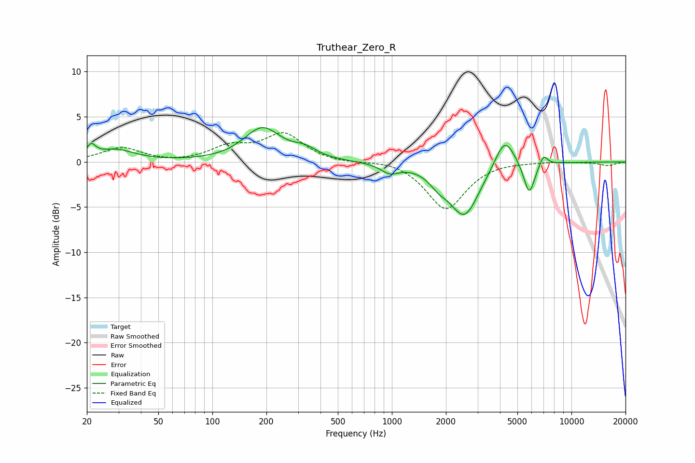

# Truthear_Zero_R
See [usage instructions](https://github.com/jaakkopasanen/AutoEq#usage) for more options and info.

### Parametric EQs
Apply preamp of -3.9 dB when using parametric equalizer.

|   # | Type    |   Fc (Hz) |    Q |   Gain (dB) |
|-----|---------|-----------|------|-------------|
|   1 | Peaking |        21 | 5.86 |         1.3 |
|   2 | Peaking |        29 | 1.35 |         1.3 |
|   3 | Peaking |       190 | 1.38 |         3.7 |
|   4 | Peaking |       328 | 2.1  |         1   |
|   5 | Peaking |       976 | 2.83 |        -1   |
|   6 | Peaking |      1826 | 2.7  |        -1.1 |
|   7 | Peaking |      2537 | 1.71 |        -5.8 |
|   8 | Peaking |      4251 | 2.57 |         3.5 |
|   9 | Peaking |      5821 | 4.48 |        -3.6 |
|  10 | Peaking |      6984 | 5.88 |         1.2 |

### Fixed Band EQs
When using fixed band (also called graphic) equalizer, apply preamp of **-3.3 dB** (if available) and set gains manually with these parameters.

|   # | Type    |   Fc (Hz) |    Q |   Gain (dB) |
|-----|---------|-----------|------|-------------|
|   1 | Peaking |        31 | 1.41 |         1.6 |
|   2 | Peaking |        62 | 1.41 |        -0.2 |
|   3 | Peaking |       125 | 1.41 |         1.5 |
|   4 | Peaking |       250 | 1.41 |         3   |
|   5 | Peaking |       500 | 1.41 |        -0.2 |
|   6 | Peaking |      1000 | 1.41 |         0.3 |
|   7 | Peaking |      2000 | 1.41 |        -5.3 |
|   8 | Peaking |      4000 | 1.41 |         0.1 |
|   9 | Peaking |      8000 | 1.41 |         0.1 |
|  10 | Peaking |     16000 | 1.41 |        -0.4 |

### Graphs

