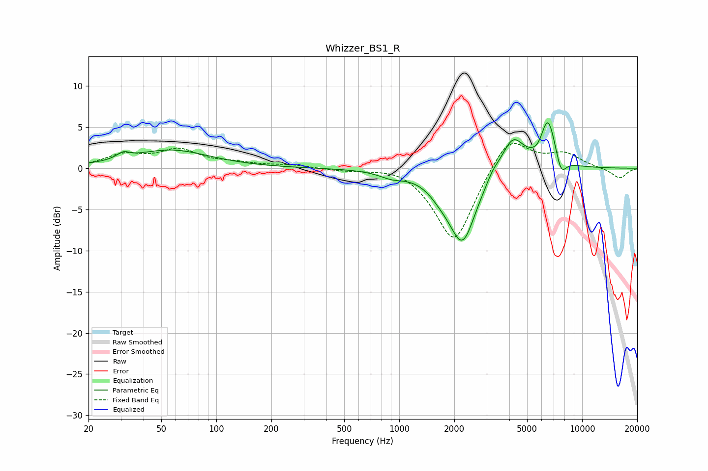

# Whizzer_BS1_R
See [usage instructions](https://github.com/jaakkopasanen/AutoEq#usage) for more options and info.

### Parametric EQs
Apply preamp of -5.6 dB when using parametric equalizer.

|   # | Type    |   Fc (Hz) |    Q |   Gain (dB) |
|-----|---------|-----------|------|-------------|
|   1 | Peaking |        31 | 4.09 |         0.7 |
|   2 | Peaking |        56 | 0.67 |         2.2 |
|   3 | Peaking |       910 | 2.09 |        -0.7 |
|   4 | Peaking |      1681 | 2.17 |        -1.1 |
|   5 | Peaking |      2215 | 1.85 |        -8.8 |
|   6 | Peaking |      3241 | 4.05 |         0.8 |
|   7 | Peaking |      4170 | 2.26 |         4.1 |
|   8 | Peaking |      5832 | 3.92 |        -0.8 |
|   9 | Peaking |      6491 | 3.11 |         6.2 |
|  10 | Peaking |      7661 | 4.6  |        -2.4 |

### Fixed Band EQs
When using fixed band (also called graphic) equalizer, apply preamp of **-3.1 dB** (if available) and set gains manually with these parameters.

|   # | Type    |   Fc (Hz) |    Q |   Gain (dB) |
|-----|---------|-----------|------|-------------|
|   1 | Peaking |        31 | 1.41 |         1.5 |
|   2 | Peaking |        62 | 1.41 |         2.1 |
|   3 | Peaking |       125 | 1.41 |         0.5 |
|   4 | Peaking |       250 | 1.41 |         0.4 |
|   5 | Peaking |       500 | 1.41 |        -0.2 |
|   6 | Peaking |      1000 | 1.41 |         0.6 |
|   7 | Peaking |      2000 | 1.41 |        -9.3 |
|   8 | Peaking |      4000 | 1.41 |         4.4 |
|   9 | Peaking |      8000 | 1.41 |         1.7 |
|  10 | Peaking |     16000 | 1.41 |        -1.3 |

### Graphs

