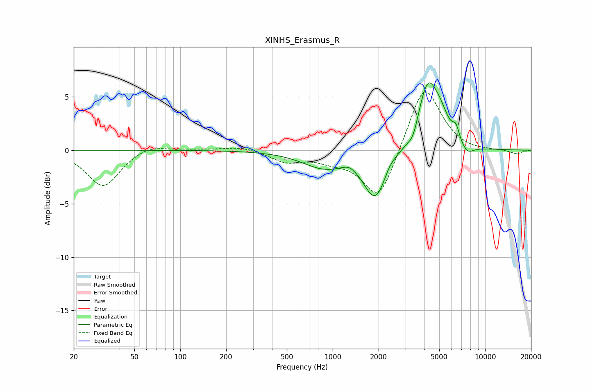

# XINHS_Erasmus_R
See [usage instructions](https://github.com/jaakkopasanen/AutoEq#usage) for more options and info.

### Parametric EQs
Apply preamp of -6.4 dB when using parametric equalizer.

|   # | Type    |   Fc (Hz) |    Q |   Gain (dB) |
|-----|---------|-----------|------|-------------|
|   1 | Peaking |       874 | 0.99 |        -1.5 |
|   2 | Peaking |      1293 | 2.92 |         0.5 |
|   3 | Peaking |      1918 | 1.8  |        -4.6 |
|   4 | Peaking |      2353 | 3.25 |         0.7 |
|   5 | Peaking |      3373 | 4.32 |        -1.1 |
|   6 | Peaking |      4192 | 2.1  |         6   |
|   7 | Peaking |      5112 | 2.48 |         1.8 |
|   8 | Peaking |      6439 | 6    |         1.2 |
|   9 | Peaking |      7474 | 2.07 |        -0.3 |
|  10 | Peaking |      7615 | 3.44 |        -0.7 |

### Fixed Band EQs
When using fixed band (also called graphic) equalizer, apply preamp of **-5.5 dB** (if available) and set gains manually with these parameters.

|   # | Type    |   Fc (Hz) |    Q |   Gain (dB) |
|-----|---------|-----------|------|-------------|
|   1 | Peaking |        31 | 1.41 |        -3.4 |
|   2 | Peaking |        62 | 1.41 |         0.6 |
|   3 | Peaking |       125 | 1.41 |         0.1 |
|   4 | Peaking |       250 | 1.41 |         0.4 |
|   5 | Peaking |       500 | 1.41 |        -1   |
|   6 | Peaking |      1000 | 1.41 |        -0.7 |
|   7 | Peaking |      2000 | 1.41 |        -4.8 |
|   8 | Peaking |      4000 | 1.41 |         6.3 |
|   9 | Peaking |      8000 | 1.41 |        -0.2 |
|  10 | Peaking |     16000 | 1.41 |        -0.4 |

### Graphs

