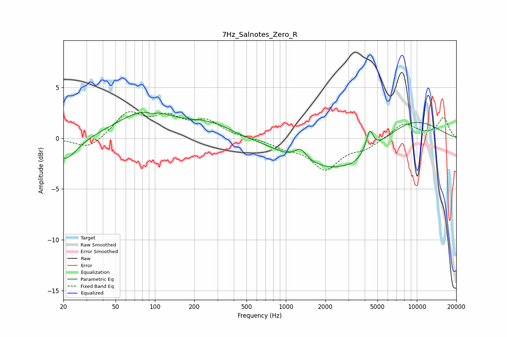

# 7Hz_Salnotes_Zero_R
See [usage instructions](https://github.com/jaakkopasanen/AutoEq#usage) for more options and info.

### Parametric EQs
Apply preamp of -2.6 dB when using parametric equalizer.

|   # | Type    |   Fc (Hz) |    Q |   Gain (dB) |
|-----|---------|-----------|------|-------------|
|   1 | Peaking |        21 | 1.5  |        -2.3 |
|   2 | Peaking |        85 | 0.66 |         2.5 |
|   3 | Peaking |        95 | 5.05 |        -0.2 |
|   4 | Peaking |       265 | 0.84 |         1.2 |
|   5 | Peaking |      1104 | 1.18 |        -0.2 |
|   6 | Peaking |      1296 | 3.16 |         1.1 |
|   7 | Peaking |      2666 | 0.43 |        -3.4 |
|   8 | Peaking |      3231 | 3.91 |        -0.1 |
|   9 | Peaking |      4364 | 5.26 |         2.1 |
|  10 | Peaking |      8387 | 0.52 |         2.5 |

### Fixed Band EQs
When using fixed band (also called graphic) equalizer, apply preamp of **-2.7 dB** (if available) and set gains manually with these parameters.

|   # | Type    |   Fc (Hz) |    Q |   Gain (dB) |
|-----|---------|-----------|------|-------------|
|   1 | Peaking |        31 | 1.41 |        -1.2 |
|   2 | Peaking |        62 | 1.41 |         2.4 |
|   3 | Peaking |       125 | 1.41 |         1.8 |
|   4 | Peaking |       250 | 1.41 |         1.5 |
|   5 | Peaking |       500 | 1.41 |        -0   |
|   6 | Peaking |      1000 | 1.41 |        -0.8 |
|   7 | Peaking |      2000 | 1.41 |        -2.9 |
|   8 | Peaking |      4000 | 1.41 |        -0.9 |
|   9 | Peaking |      8000 | 1.41 |         1.5 |
|  10 | Peaking |     16000 | 1.41 |         2   |

### Graphs

