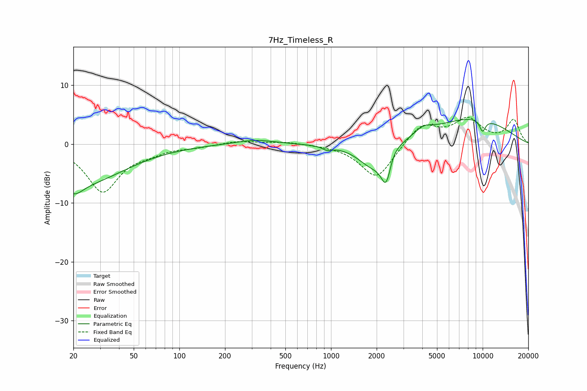

# 7Hz_Timeless_R
See [usage instructions](https://github.com/jaakkopasanen/AutoEq#usage) for more options and info.

### Parametric EQs
Apply preamp of -4.3 dB when using parametric equalizer.

|   # | Type    |   Fc (Hz) |    Q |   Gain (dB) |
|-----|---------|-----------|------|-------------|
|   1 | Peaking |        20 | 2.32 |        -2.7 |
|   2 | Peaking |        25 | 0.52 |        -6   |
|   3 | Peaking |       316 | 1.09 |         0.8 |
|   4 | Peaking |       944 | 4.59 |        -0.6 |
|   5 | Peaking |      1854 | 1.47 |        -3.7 |
|   6 | Peaking |      2320 | 3.89 |        -7.1 |
|   7 | Peaking |      2457 | 3.11 |         2.5 |
|   8 | Peaking |      4078 | 2.32 |         1.3 |
|   9 | Peaking |      8607 | 0.47 |         4.4 |
|  10 | Peaking |      9982 | 6    |        -2   |

### Fixed Band EQs
When using fixed band (also called graphic) equalizer, apply preamp of **-4.6 dB** (if available) and set gains manually with these parameters.

|   # | Type    |   Fc (Hz) |    Q |   Gain (dB) |
|-----|---------|-----------|------|-------------|
|   1 | Peaking |        31 | 1.41 |        -8   |
|   2 | Peaking |        62 | 1.41 |        -1   |
|   3 | Peaking |       125 | 1.41 |        -0.4 |
|   4 | Peaking |       250 | 1.41 |         0.6 |
|   5 | Peaking |       500 | 1.41 |         0.4 |
|   6 | Peaking |      1000 | 1.41 |        -0.1 |
|   7 | Peaking |      2000 | 1.41 |        -6   |
|   8 | Peaking |      4000 | 1.41 |         3.5 |
|   9 | Peaking |      8000 | 1.41 |         4   |
|  10 | Peaking |     16000 | 1.41 |         4   |

### Graphs

