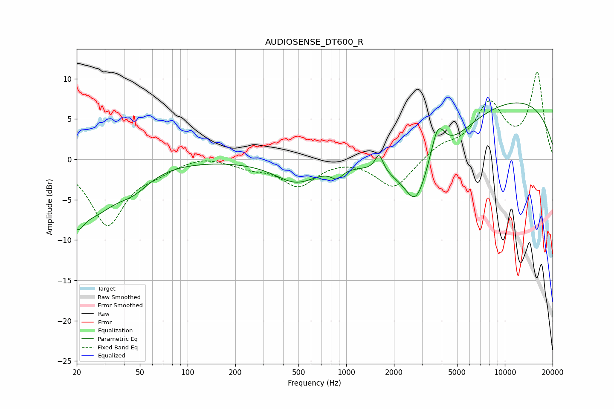

# AUDIOSENSE_DT600_R
See [usage instructions](https://github.com/jaakkopasanen/AutoEq#usage) for more options and info.

### Parametric EQs
Apply preamp of -7.1 dB when using parametric equalizer.

|   # | Type    |   Fc (Hz) |    Q |   Gain (dB) |
|-----|---------|-----------|------|-------------|
|   1 | Peaking |        20 | 3.23 |        -4   |
|   2 | Peaking |        26 | 1.01 |        -5.4 |
|   3 | Peaking |        45 | 1.28 |        -2.2 |
|   4 | Peaking |       483 | 1.04 |        -2.7 |
|   5 | Peaking |       873 | 4.04 |        -1.1 |
|   6 | Peaking |      1612 | 5.56 |         2.2 |
|   7 | Peaking |      2743 | 2.33 |        -3.7 |
|   8 | Peaking |      3060 | 0.61 |        -7.1 |
|   9 | Peaking |      3773 | 2.99 |         4.9 |
|  10 | Peaking |      8995 | 0.21 |         8   |

### Fixed Band EQs
When using fixed band (also called graphic) equalizer, apply preamp of **-10.9 dB** (if available) and set gains manually with these parameters.

|   # | Type    |   Fc (Hz) |    Q |   Gain (dB) |
|-----|---------|-----------|------|-------------|
|   1 | Peaking |        31 | 1.41 |        -8   |
|   2 | Peaking |        62 | 1.41 |        -1.1 |
|   3 | Peaking |       125 | 1.41 |         0.6 |
|   4 | Peaking |       250 | 1.41 |        -0.9 |
|   5 | Peaking |       500 | 1.41 |        -3.2 |
|   6 | Peaking |      1000 | 1.41 |         0.2 |
|   7 | Peaking |      2000 | 1.41 |        -3.7 |
|   8 | Peaking |      4000 | 1.41 |         1.5 |
|   9 | Peaking |      8000 | 1.41 |         6.5 |
|  10 | Peaking |     16000 | 1.41 |        10.5 |

### Graphs

