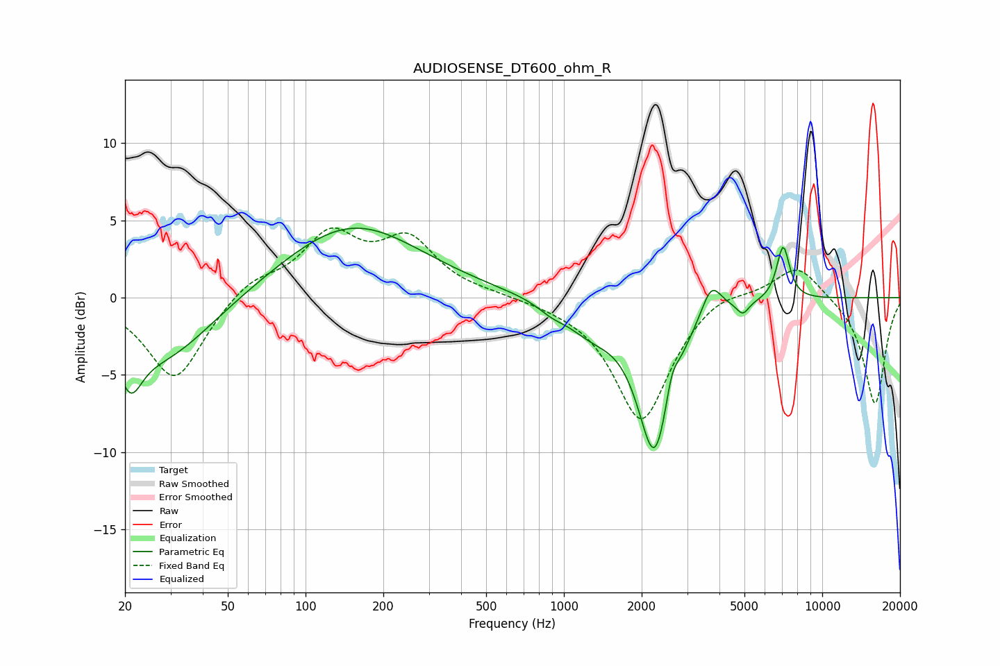

# AUDIOSENSE_DT600_ohm_R
See [usage instructions](https://github.com/jaakkopasanen/AutoEq#usage) for more options and info.

### Parametric EQs
Apply preamp of -4.6 dB when using parametric equalizer.

|   # | Type    |   Fc (Hz) |    Q |   Gain (dB) |
|-----|---------|-----------|------|-------------|
|   1 | Peaking |        21 | 3.15 |        -3.1 |
|   2 | Peaking |        28 | 0.73 |        -4.1 |
|   3 | Peaking |       151 | 0.53 |         4.8 |
|   4 | Peaking |       894 | 2.71 |        -0.5 |
|   5 | Peaking |      1271 | 1.4  |        -1.6 |
|   6 | Peaking |      2245 | 2.11 |        -9.8 |
|   7 | Peaking |      2612 | 6    |         1.5 |
|   8 | Peaking |      3720 | 3.56 |         2.2 |
|   9 | Peaking |      4926 | 5.99 |        -0.8 |
|  10 | Peaking |      7058 | 5.38 |         3.5 |

### Fixed Band EQs
When using fixed band (also called graphic) equalizer, apply preamp of **-4.6 dB** (if available) and set gains manually with these parameters.

|   # | Type    |   Fc (Hz) |    Q |   Gain (dB) |
|-----|---------|-----------|------|-------------|
|   1 | Peaking |        31 | 1.41 |        -5.4 |
|   2 | Peaking |        62 | 1.41 |         1.2 |
|   3 | Peaking |       125 | 1.41 |         3.8 |
|   4 | Peaking |       250 | 1.41 |         3.5 |
|   5 | Peaking |       500 | 1.41 |         0.2 |
|   6 | Peaking |      1000 | 1.41 |        -0.2 |
|   7 | Peaking |      2000 | 1.41 |        -8   |
|   8 | Peaking |      4000 | 1.41 |         0.8 |
|   9 | Peaking |      8000 | 1.41 |         2.3 |
|  10 | Peaking |     16000 | 1.41 |        -7   |

### Graphs

