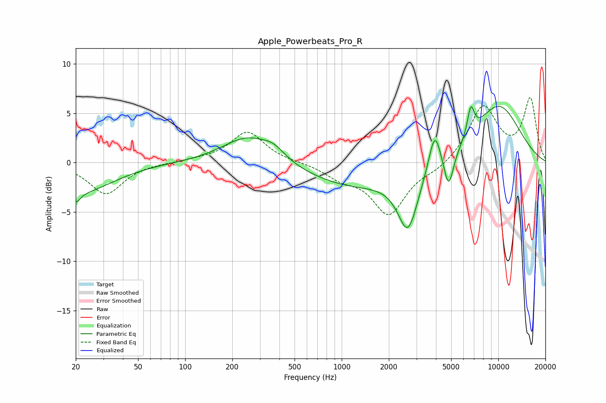

# Apple_Powerbeats_Pro_R
See [usage instructions](https://github.com/jaakkopasanen/AutoEq#usage) for more options and info.

### Parametric EQs
Apply preamp of -5.8 dB when using parametric equalizer.

|   # | Type    |   Fc (Hz) |    Q |   Gain (dB) |
|-----|---------|-----------|------|-------------|
|   1 | Peaking |        20 | 4.93 |        -1.2 |
|   2 | Peaking |        22 | 0.69 |        -2.9 |
|   3 | Peaking |       254 | 0.87 |         2.8 |
|   4 | Peaking |       368 | 2.1  |         0.9 |
|   5 | Peaking |      1199 | 0.43 |        -2.4 |
|   6 | Peaking |      2649 | 2.2  |        -5.9 |
|   7 | Peaking |      3926 | 3.72 |         4   |
|   8 | Peaking |      4822 | 4.54 |        -3.6 |
|   9 | Peaking |      6678 | 6    |         2.9 |
|  10 | Peaking |     10000 | 0.77 |         5.8 |

### Fixed Band EQs
When using fixed band (also called graphic) equalizer, apply preamp of **-6.7 dB** (if available) and set gains manually with these parameters.

|   # | Type    |   Fc (Hz) |    Q |   Gain (dB) |
|-----|---------|-----------|------|-------------|
|   1 | Peaking |        31 | 1.41 |        -3.2 |
|   2 | Peaking |        62 | 1.41 |        -0   |
|   3 | Peaking |       125 | 1.41 |         0.2 |
|   4 | Peaking |       250 | 1.41 |         3.1 |
|   5 | Peaking |       500 | 1.41 |         0   |
|   6 | Peaking |      1000 | 1.41 |        -1.3 |
|   7 | Peaking |      2000 | 1.41 |        -5.1 |
|   8 | Peaking |      4000 | 1.41 |        -0.7 |
|   9 | Peaking |      8000 | 1.41 |         5.7 |
|  10 | Peaking |     16000 | 1.41 |         6.3 |

### Graphs

