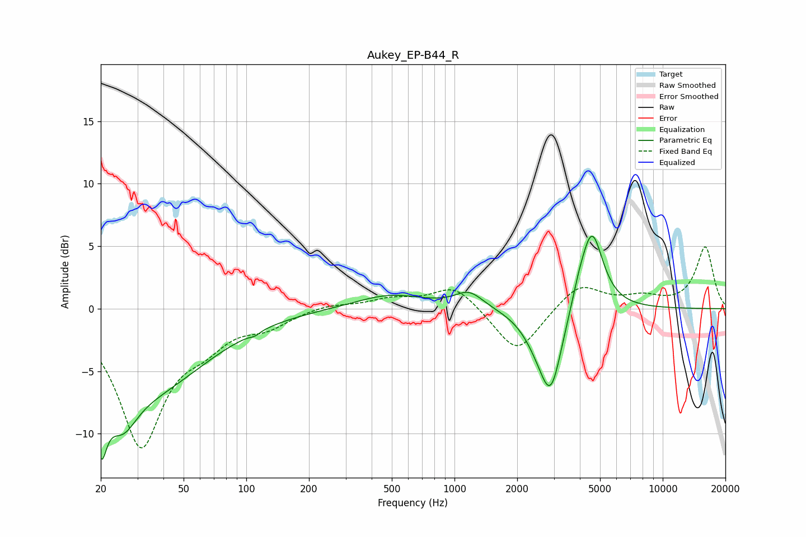

# Aukey_EP-B44_R
See [usage instructions](https://github.com/jaakkopasanen/AutoEq#usage) for more options and info.

### Parametric EQs
Apply preamp of -5.9 dB when using parametric equalizer.

|   # | Type    |   Fc (Hz) |    Q |   Gain (dB) |
|-----|---------|-----------|------|-------------|
|   1 | Peaking |        20 | 4.99 |        -5.5 |
|   2 | Peaking |        25 | 1.95 |        -3.8 |
|   3 | Peaking |        35 | 0.51 |        -6   |
|   4 | Peaking |       110 | 5.98 |        -0.2 |
|   5 | Peaking |       490 | 0.84 |         1.1 |
|   6 | Peaking |      1176 | 2.09 |         1.3 |
|   7 | Peaking |      2498 | 1.88 |        -1.5 |
|   8 | Peaking |      2903 | 2.57 |        -6.1 |
|   9 | Peaking |      3949 | 3.89 |         1   |
|  10 | Peaking |      4567 | 2.6  |         6.4 |

### Fixed Band EQs
When using fixed band (also called graphic) equalizer, apply preamp of **-5.0 dB** (if available) and set gains manually with these parameters.

|   # | Type    |   Fc (Hz) |    Q |   Gain (dB) |
|-----|---------|-----------|------|-------------|
|   1 | Peaking |        31 | 1.41 |       -10.8 |
|   2 | Peaking |        62 | 1.41 |        -1.9 |
|   3 | Peaking |       125 | 1.41 |        -1.2 |
|   4 | Peaking |       250 | 1.41 |         0.4 |
|   5 | Peaking |       500 | 1.41 |         0.7 |
|   6 | Peaking |      1000 | 1.41 |         1.9 |
|   7 | Peaking |      2000 | 1.41 |        -3.7 |
|   8 | Peaking |      4000 | 1.41 |         2.1 |
|   9 | Peaking |      8000 | 1.41 |         0.8 |
|  10 | Peaking |     16000 | 1.41 |         4.9 |

### Graphs

